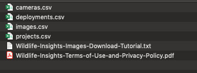
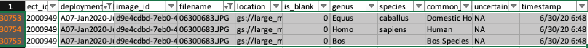

```{r setup2, include=FALSE}
knitr::opts_chunk$set(echo = TRUE)
knitr::opts_chunk$set(message = FALSE, warning = FALSE)
```

# Wildlife Insights (WI)

Wildlife Insights (WI) is an initiative developed by Conservation International in partnership with the Wildlife Conservation Society, World Wildlife Fund, Zoological Society of London, The Smithsonian Institution, North Carolina Museum of Natural Sciences, Yale University and Google [@ahumada_wi]. WI provides an interface and tools to support workflows for processing, visualizing, and analyzing camera trap data. These tools include infrastructure to store, review and process images, AI to classify species and blanks, and an analysis engine for implementing common statistical methods with camera trap data (e.g., estimation of species' activity patterns, occupancy, density and diversity indices) [@ahumada_wi]. Beyond serving as an interface for image processing and data analysis, WI was also conceived as a data repository for hosting camera trap data collected worldwide; images and associated metadata stored in WI can be downloaded by the public after sensitive content (e.g., images with people or endangered species) has been removed and once an embargo time (maximum 48 months) provided by data providers has passed [@ahumada_wi].

WI provides comprehensive guides for navigating the platform and tutorials showing step-by-step usage of the system's features. This documentation can be found here: <https://www.wildlifeinsights.org/get-started>.  


Additionally, WI provides references describing how their AI models work along with a table listing species used for model training and performance metrics for each species, which users can consult here: <https://www.wildlifeinsights.org/about-wildlife-insights-ai>. We synthesize some of the key navigation steps and illustrate how one can evaluate performance of built-in AI models. Specifically, we provide code for comparing human classifications with model predictions for a subset of your images. This comparison will be useful to better understand how AI models are likely to perform with your particular images and whether AI may be able to provide accurate enough classification for some of your species. 

**Before we get started**: if you plan to compare model predictions with human classifications, you should download computer vision identifications right after uploading pictures to the WI platform (see Section \@ref(wi-performance)).  It is important that you have a record of the WI classifications **before you do any processing on your data**.  

## Set-up

- Create an account here <https://app.wildlifeinsights.org/join>
- In WI, you can structure your data hierarchically. Below, we provide an example structure from our camera trapping project in Colombia:

  - Organization: University of Minnesota
  - Initiative: Wildlife monitoring in South America using camera traps. 
  - Project: Large mammals Colombia.
  - Subprojects:
      - Jul2019-Jan2020 Deployment
      - Jan2020-Jul2020 Deployment
  - Location: We use alphanumerical codes to name each camera trap location, with letters representing different areas within our study area (Figure \@ref(fig:locations)). Each location has its own geographical coordinates.
  - Deployment: Information for deployments include temporal record (start and end dates) of a camera trap survey within a particular location. In our example, for our location "A08" a camera trap was deployed from 2019-07-10 to 2020-01-08 (Figure \@ref(fig:deployments)).

This data structure allows you to manage multiple collaborators and data sets collected by different organizations and teams but associated with a single purpose [@wi_initiatives]. For example, an "Initiative" allows you to share a project between different organizations [@wi_initiatives] which facilitates data management and labor distribution.

Hierarchical data storage also might help to organize and filter subsets of images or data. For example "Projects" can contain "Subprojects" that might represent groups of deployments and/or locations. See the Glossary page for more terms found in WI <https://www.wildlifeinsights.org/get-started/glossary>.

```{r locations, fig.cap='Locations of camera traps mapped in the Wildlife Insights platform along with location names and geographical coordinates.', out.width='100%', fig.asp=.95, fig.align='center', echo = FALSE}

knitr::include_graphics("input_figures/wi/locations.png")
```

```{r deployments, fig.cap='Deployments showing "Start date" and "End date" for each camera loaction.', out.width='100%', fig.asp=.75, fig.align='center', echo = FALSE}

knitr::include_graphics("input_figures/wi/deployments.png")
```

## Upload/format data 

You can upload already labeled images (e.g., for storing and managing pictures in the cloud) or unlabeled images to be processed.

- For labeled images, you will need to (re)format images' metadata using the WI batch upload templates and transfer images from a public URL (e.g., Google Drive)  or directly to the Google Cloud Platform. See <https://www.wildlifeinsights.org/get-started/upload/bulk-data-uploads>

- For unlabeled images, you can upload images via the WI platform. Images will then be stored in the Google Cloud Platform and displayed in the user's project. See <https://www.wildlifeinsights.org/get-started/upload/upload-new-data>

## Upload/enter metadata

Metadata, such as the time and date each picture was taken, the filename, camera trap name and Exif data (camera settings: photo exposure, ISO and aperture) are automatically read once unlabeled pictures are uploaded.

```{r metadat1-fig, fig.cap='Picture metadata displayed after uploading an image to Wildlife Insights online platform.', out.width='85%', fig.asp=.75, fig.align='center', echo = FALSE}

knitr::include_graphics("input_figures/wi/metadata.png")
```

You can provide additional metadata, including coordinates for the camera trap or other features associated with camera deployment (e.g., dates, camera height, settings, use of bait, etc.). This information can be entered manually for each deployment or you can use a CSV file formatted using the WI template for a bulk deployment upload. See the deployments guide <https://www.wildlifeinsights.org/get-started/manage-metadata/deployments.> 

## Processing images - AI module

Once images are uploaded, they will be processed by WI's AI model. Computer vision classifications will be available in the WI platform as soon as your pictures are uploaded (which can take ~ 11 minutes per 1000 pictures  with a 225 Mbps internet upload speed). Additionally, after pictures are uploaded, you can download the output (see download tab in the upper right corner of Figure \@ref(fig:wiproject-fig)). The output will include a CSV file with the AI classifications (See Section \@ref(wi-output) for more information on WI output); you will receive an email with a link for downloading the output approximately 5 minutes after requesting it. **Again, to facilitate evaluation of AI performance, we recommend downloading this CSV file before you do any other manipulations in the WI platform**.

Your project in WI will include the uploaded pictures in the "Identify" tab. Species classifications will be shown whenever the confidence values associated with the AI-classifications are above 65% and 95% for species and blanks, respectively; otherwise images will get a "No CV Result" label [@wi_review]. You will be able to verify if these classifications are correct, after which they will be moved to the "Catalogued" tab (Figure \@ref(fig:wiproject-fig)).

```{r wiproject-fig, fig.cap='WI processing module after uploading pictures.', out.width='85%', fig.asp=.75, fig.align='center', echo = FALSE}

knitr::include_graphics("input_figures/wi/project.png")
```

## Post-AI image processing

WI provides a platform with multiple tools for reviewing images, allowing users to verify AI output. In addition, users can: 

- Sort images by "Date taken", "Upload date" or "Last modification" (the latter only for "Catalogued" images) (Figure \@ref(fig:wiproject-fig)).
- Filter images by categories such as Subprojects, Deployments, Species, Status (e.g., Blank or Not blank) or Photos (e.g., Highlighted pictures for quick access or Not highlighted) (Figure \@ref(fig:wiproject-fig)).
- Edit under- or over-exposed pictures by adjusting brightness, contrast and saturation.
- Edit identifications using bulk actions by selecting and entering information for multiple pictures at a time (e.g., for 100 or 200 images).
- Group images within a Burst defined by a timeframe (from 0-600 seconds) to perform bulk actions.
- Manage collaborations for data processing by assigning different roles with different levels of data access (e.g., project owner, editor, contributor, tagger, viewer).

## Using AI output {#wi-output}

All the above mentioned processing tools can be used to review and verify AI output presented in the "Identify" tab. You can approve computer vision identifications or edit them in the processing module. You can also include additional identifications if more than 1 animal (of the same or different species) is present in the picture and add other identifying information (e.g., sex, age, markings for each individual) or other remarks (e.g., comments or observations) that may be useful.

When you download the resulting output, you will receive 4 different files that capture data related to your cameras, their deployments, and your projects (Figure \@ref(fig:wi-output-fig)):

- `cameras.csv`: contains metadata related to the cameras, including camera_id, make, model, serial_number and year purchased.
- `deployments.csv`: contains deployment dates, geographical coordinates, details of camera trap placement and camera settings.
- `images.csv`:  includes classifications and features recorded for each image.
- `projects.csv`: includes project details such as project objectives, licenses for metadata and images, and information about the sampling design used for camera trap deployment.

```{r wi-output-fig, fig.cap='WI files created when you download project information and AI processed data.', out.width='80%', fig.asp=.75, fig.align='center', echo = FALSE}


```

In additional to these 4 CSV files, the folder with downloaded data will contain a tutorial for downloading images from WI and a file containing WI terms of use and privacy policy (Figure \@ref(fig:wi-output-fig)).

You can also quickly inspect AI results in the Summary tab (upper left of Figure \@ref(fig:wiproject-fig)). You will see a map with your camera locations and a summary of the species in your data set (Figure \@ref(fig:wi-summary-fig)).

```{r wi-summary-fig, fig.cap='WI summary of images by type and identified species.', out.width='80%', fig.asp=.75, fig.align='center', echo = FALSE}

knitr::include_graphics("input_figures/wi/summary.png")
```

## Assessing AI performance  {#wi-performance}

AI classification systems have been improving, but their performance is still highly variable, both across study sites and species [@tabak_2018]. Thus, it is extremely important to evaluate model performance with your data set.  Before reviewing all the pictures and AI classifications, you can classify a subset of your pictures and compare these identifications with AI output. This step will allow you to determine how well the model is working for various species of interest and also to determine if there are particular species or locations where model performance is particularly poor.

Below, we demonstrate a step-by-step workflow for how to get WI output into R, join computer and human vision identifications, and estimate model performance metrics for each species. Throughout, we will use the `purrr` package in R [@purrr; @R-base] to repeatedly apply the same function to objects in a list or column in a nested data frame efficiently and without the need for writing loops. Readers unfamiliar with `purrr` syntax, may want to view one or more of the tutorials, below, or make use of the [purrr cheat sheet](https://github.com/rstudio/cheatsheets/blob/master/purrr.pdf).

- http://www.rebeccabarter.com/blog/2019-08-19_purrr/
- https://www.r-bloggers.com/2020/05/one-stop-tutorial-on-purrr-package-in-r/
- https://jennybc.github.io/purrr-tutorial/index.html

1. Right after uploading pictures to the WI platform and ***before*** doing any image processing (i.e., identification), download the WI output with the download tab (see Figure \@ref(fig:wiproject-fig)). WI's computer vision identifications will be contained in the images.csv file (Figure \@ref(fig:wi-compvision-fig)). Save that file as `images_cv.csv`.
  
```{r wi-compvision-fig, fig.cap='Identifications provided by computer vision', out.width='80%', fig.asp=.75, fig.align='center', echo = FALSE}

knitr::include_graphics("input_figures/wi/compvision.png")
```
  
2. Use the WI processing module to verify a subset of your pictures (e.g., ~100,000)  and either accept the computer vision identification as correct or edit the identification with the correct species label. The identified_by column presented in Figure 2.5 will change according to the new identifier (Figure \@ref(fig:wi-newid-fig)). 

```{r wi-newid-fig, fig.cap='Identifications verified by a human', out.width='90%', fig.asp=.75, fig.align='center', echo = FALSE}

knitr::include_graphics("input_figures/wi/newid.png")
``` 

3. Once you finish identifying a subset of your images, download the data from WI and change the name of the images.csv file to `images_hv.csv`. Create a data folder to store your two CSV files `images_cv.csv` and `images_hv.csv` that refer to classifications of computer and human vision, respectively. We provide an example of both files with the repository associated with this guide, named `images_cv_jan2020_raw.csv` and `images_hv_jan2020_raw.csv`.

4. Process the two data files using the R code provided in the sections below.

### Reading in data, introduction to the Purrr package

Before comparing human and computer vision we need to do some data cleaning. This cleaning includes removing duplicated uploads to the WI platform and making sure to keep a single record for each image, as WI creates multiple rows when more than one animal (or object) is identified in an image.

First, we load required libraries. 
  
```{r libraries, echo =TRUE, warning=FALSE, message=FALSE}
library(tidyverse) # for data wrangling and visualization, includes dplyr and purrr
library(here) # to allow use of relative paths
library(DT) # for viewing data tables
```

Next, we tell R the path (i.e., directory name) that holds our files.  We will use the `here` package [@here] to tell R that our files live in the "./data/wi" directory. You may, alternatively, type in the full path to the file folder or a relative path from the root directory if you are using a project in Rstudio. 

```{r filefolder, message=FALSE}
# Create filefolder's path. This should point to the folder name
# where you stored your CSV files downloaded from WI
filesfolder <- here("data", "wi") 
filesfolder
```

Next, we use the `dir` function to list the files contained in the filesfolder directory.  
```{r filefolder2, message=FALSE}
# list all your CSV files (i.e., "images_cv_jan2020_raw.csv" and "images_hv_jan2020_raw.csv")
files <- dir(filesfolder, pattern = "*.csv") 
files
```

We then use the `map` function in the `purrr` package to read in all of the files and store them in a list object named `mycsv`.  The first argument to `map` is a list (here, `files`) which is "piped in" using `%>%` from the `magrittr` package [@magrittr]. Pipes (`%>%`) provide a way to execute a sequence of data operations, organized so that the operations can be read from left to right (e.g., "Take this set of files and then read them in using `read_csv`"). The second argument to `map` is a function, in this case `read_csv`, to be applied to the list. The `map` function iterates over the two files stored in the `files` object, reads in the data files and then stores them in a new list named `mycsv.` We use `~` to refer to our function and use `.x` to refer to the list object that is passed to the function as an additional argument.   

```{r readdata}
# Read both CSV files
mycsv <- files %>% 
  map(~ read_csv(file.path(filesfolder, .x)))

# Inspect how the data sets look like
mycsv 

```

There are many variables that we will not need when evaluating AI performance.  To simplify things, we use the `select` function to only keep the variables of interest:

- `deployment_id`: deployment name including camera location.
- `filename`: image filename.
- `timestamp`: time of a camera trigger.
- `image_id`: WI identifier for images uploaded to the platform. 
- `common_name`: species' common name labeled either by computer or human vision.
- `cv_confidence`: confidence value associated with the computer vision label.

Additionally, we remove images without a classification (i.e., common_name = "NA") and with the "Human" class, as human images in this data set predominately correspond to camera-set-up images. We inspect the final number of rows using `nrow()`.

```{r}
mycsv <- mycsv %>% 
  map(~.x %>% 
        select(deployment_id, filename, timestamp, image_id, common_name, cv_confidence) %>% 
        filter(!is.na(common_name)) %>% 
        filter(common_name != "Human" & common_name != "Human-Camera Trapper"))

mycsv %>% map(~.x %>% nrow())
```

### Removing duplicate images 

Before discussing how to join the two data sets corresponding to human and computer vision, we need to remove duplicated rows that might result from accidentally uploading the same image more than once to the WI platform. We can identify these duplicated uploads as they contain the same information in all the columns except for `image_id`. Figure \@ref(fig:wi-duplicated-fig) shows two different examples of duplicated uploads.

```{r wi-duplicated-fig, fig.cap='Identification of duplicated image uploads in the images.csv WI output.', out.width='150%', fig.asp=.75, fig.align='center', echo = FALSE}

knitr::include_graphics("input_figures/wi/duplicated_uploads.png")
``` 

We will use the information contained in `deployment_id`, `filename`, and `timestamp` to uniquely identify each image event; hereafter, we will refer to this suite of variables as key columns.  To remove duplicates in our data sets, we first use the `group_by` function to group rows using these key columns and store our grouped dataframe as `mycsv_grouped`.  We use the `summarise` function [@R-dplyr] to create a new column `uploads` that contains the count of unique `image_id` values for each group of rows. Groups that have more than one `image_id` indicate duplicated uploads (Figure \@ref(fig:wi-duplicated-fig)). We then filter by counts > 1 to inspect duplicated images, remove duplicated rows in our data sets using the `unique` function [@R-base] and store the remaining data in the `no_duplicates` list object.

```{r}
mycsv_grouped <- mycsv %>% 
  map(~.x %>% 
  group_by(deployment_id, filename, timestamp))

# Create data set with duplicated images
duplicated_images <- mycsv_grouped %>%
  map(~.x %>% 
  summarise(uploads = length(unique(image_id))) %>% # count unique ID's
    filter(uploads > 1)) # for inspecting duplicated uploads

# Create a data set without the duplicated images
no_duplicates <- mycsv_grouped %>% 
  map(~.x %>% 
  filter(image_id == unique(image_id)[1])) 
# This code keeps all the records that have a single image ID and keeps only
# one record of duplicated uploads selected by indexing the first "image_id" within a group

```

### Images with multiple observations of the same species

WI creates extra rows when you identify more than one animal per picture. Thus, it is likely that your two CSV files will slightly differ in number of rows (as is the case here). After removing duplicated records, we need to drop extra rows in the human vision data frame that result from identifying more than 1 animal of the same species in the same image. As an example, Figure \@ref(fig:wi-distinct-dets-fig) displays records for both a juvenile and adult Southern tamandua detected in the same image. 

```{r wi-distinct-dets-fig, fig.cap='Highlighted rows represent detections of one juvenile and an adult of the Southern Tamandua in the same image.', out.width='150%', fig.asp=.75, fig.align='center', echo = FALSE}

knitr::include_graphics("input_figures/wi/distinct_dets.png")
``` 

We regroup the data by the key columns from before, adding `common_name`; we also add `cv_confidence`  to retain this variable for later use. We then apply the `summarise` function to reduce multiple records of the same species in the same image to a single record. 

```{r}
same_sp_dets <- no_duplicates %>% 
  map(~.x %>% 
  group_by(deployment_id, filename, timestamp, cv_confidence, common_name) %>%
    summarise() %>% # summarise rows that correspond to different animals of the same species 
    ungroup()) 
```

We will use the human vision data set contained in the `same_sp_dets` list object as the ground truth when evaluating model performance for all platforms reviewed in this gitbook.  This list object has been saved as `images_hv_jan2020.csv` using the following code.

```{r, eval = FALSE}
write_csv(same_sp_dets %>% pluck(2) %>% select(-cv_confidence), 
          file = "data/wi/processed_data/images_hv_jan2020.csv")
```

Now that we removed duplicated records and multiple observations of the same species in the same image, we can proceed to join the computer and human vision data sets. We will match rows using a `right_join`, specifying our key columns as unique image identifiers to pair the cases from the two data sets. This will keep all records in the human vision data set and their corresponding matches in the computer vision data set. Records that are only in the computer vision data set will be dropped from further consideration. We add either a `_cv` or `_hv` suffix to the `common_name` to indicate classification by computer and human, respectively.

```{r}
both_visions <- same_sp_dets %>% 
  reduce(right_join, by = c("filename", "deployment_id", "timestamp"), suffix = c("_cv", "_hv"))
```

### Images with multiple species

Similar to multiple detections of the same species, when we identify different species in the same image, these observations will be recorded in  separate rows in the human vision data set (Figure \@ref(fig:wi-multiple-sp-fig)). When using the `right_join` to match observations from the computer and human vision data sets, some of the  computer vision labels will be replicated to match the multiple rows generated for different species detected in the same image by human vision. 

```{r wi-multiple-sp-fig, fig.cap='Highlighted rows represent detections of different species in the same image.', out.width='150%', fig.asp=.75, fig.align='center', echo = FALSE}


``` 

To address this complication, we create a `sp_num` column containing the number of species per image, which can then be used to identify records with more than one species in an image `sp_num > 1`. We then subset the observations that have more than 1 species in an image.

```{r}
both_visions <- both_visions %>%
  group_by(deployment_id, filename, timestamp) %>% 
  mutate(sp_num = length(unique(common_name_hv)))

multiple_sp_dets <- both_visions %>%
  filter(sp_num > 1) 
```

For each of these images, we determine if there is a match between computer and human vision.  We find that there are three images where AI was able to correctly identify one of the species present.

```{r}
options(width=180)
multiple_sp_dets %>% 
  filter(common_name_cv %in% common_name_hv) %>% 
  ungroup() %>%
  select(!c(timestamp, deployment_id, cv_confidence_hv,  sp_num)) %>%
  print(width=Inf, n=1000)

```

We can also look at some of the records for images that had multiple species in them but AI failed to correctly identify any of them.
```{r}
multiple_sp_dets %>% 
  filter(!common_name_cv %in% common_name_hv) %>%
  ungroup() %>%
  select(!c(timestamp, deployment_id, cv_confidence_hv,  sp_num)) %>%
  head(10)

```

We then need to decide how to treat these records. Because WI will only identify 1 species in an image, we want to give it credit when it matches one of multiple species present. We also choose to consider it a single failure when AI fails to match any of the multiple species present. Thus, we chose to create a data set that combines:

- records for all images that contain only 1 species
- the matched observation whenever there are multiple species present and one of them is identified using AI
- the first observation whenever there are multiple species present and AI fails to identify any of them
```{r}
dataA <- both_visions %>%
  filter(sp_num ==1)  %>%
  ungroup() %>% 
  drop_na(common_name_hv)

dataB <- multiple_sp_dets %>%
  filter(common_name_cv %in% common_name_hv) %>%
  ungroup() %>%
  filter(common_name_cv == common_name_hv)%>% 
  drop_na(common_name_hv)

dataC <- multiple_sp_dets %>%
  filter(!common_name_cv %in% common_name_hv) %>%
  filter(row_number()==1) %>%
  ungroup()%>% 
  drop_na(common_name_hv)
  
both_visions_clean<- rbind(dataA,
                            dataB, 
                            dataC)

```


### Summarizing human and computer vision records by species

Next, we count the number of records of each species separately for human and computer vision. We will group the data by `common_name` and then count the number of observations using `n()` inside `summarise`. Then, we use the `full_join` function to join the species counts in computer and human vision using the `common_name` to match observations in the two data sets. Lastly, we add a suffix to the `common_name` variable to distinguish the counts of human and computer vision.

```{r species counts}
sp_counts_cv <- both_visions_clean %>% 
  group_by(common_name_cv) %>% 
        summarise(n = n()) %>% 
  rename(common_name = common_name_cv)

sp_counts_hv <- both_visions_clean %>% 
  group_by(common_name_hv) %>% 
        summarise(n = n()) %>% 
  rename(common_name = common_name_hv)

sp_counts <- full_join(sp_counts_cv, sp_counts_hv, 
                       by = "common_name", 
                       suffix = c("_cv", "_hv")) %>% 
  arrange(common_name) %>% 
  mutate(common_name = as.factor(common_name))

```


You can inspect the resulting data frame with the per-species counts for the two visions (Table \@ref(tab:myDThtmltools1)).


```{r wi-species-tab, echo=FALSE, warning=FALSE, results="asis"}
library(huxtable)
library(knitr)

if(is_html_output()==TRUE){
options(width=180)
datatable(sp_counts)
}
cat("<table>",paste0("<caption>", "(#tab:myDThtmltools1)",  "Counts of images classified by Wildlife Insights AI (n_cv, using a 0.65 and 0.95 confidence threshold for predicting species and blanks, respectively) and humans (n_hv) for each species in the data set.", "</caption>"),"</table>", sep ="\n")
```

When looking at the table of species counts, you will likely notice that you have some species that show up in the computer vision (i.e., AI) data set that are not present in the human vision data set and vice versa.  Using  the `sp_counts` data frame (Table \@ref(tab:myDThtmltools1)) calculated above, we can easily identify the species labels that are not found in both data sets. We can then simplify the table by replacing labels found only in the human vision data set as "Other_hv" and labels only found in the computer vision data set as "Other_cv". Doing so will allow us to create a simplified  confusion matrix (a matrix that shows the combinations of all predicted and true classifications used to inspect model performance).

We begin by creating new data sets, `NAcv` and `NAhv`, to contain the species labels that are only found in one of the two data sets. 

```{r NAs}
NAcv <-  sp_counts %>%
  filter(is.na(n_cv))

NAhv <- sp_counts %>% 
  filter(is.na(n_hv))
```

We then replace species names not shared by both visions by "Other_cv" and "Other_hv" for computer and human vision, respectively, using the species labels stored in `NAcv` and `NAhv`. We use the `mutate` and `if_else` functions [@R-dplyr] to overwrite the original species names with these new labels. 


```{r}
# Replace categories within the NA's vector by "Other_cv" or "Other_hv
replace_others <- both_visions_clean %>%
       mutate(common_name_hv = if_else(common_name_hv %in% NAcv$common_name,
                                       "Other_hv",
                                       as.character(common_name_hv)),
              common_name_cv = if_else(common_name_cv %in% NAhv$common_name,
                                       "Other_cv",
                                       as.character(common_name_cv))) %>%
  rename(conf_cv = cv_confidence_cv) 
# Both inputs in both visions and NA's vectors are characters. 
# Both true and false cases for the if_else statements have to be of the same class.

```


### Confusion matrix and performance measures 

Using the `replace_others` data frame, we can estimate a confusion matrix using the `confusionMatrix` function from the `caret` package [@R-caret] and plot it using `ggplot2` [@R-ggplot2]. The `confusionMatrix` function requires a data argument for predicted classes and a reference for true classifications, both as factor classes and with the same factor levels. We use the `factor` and the `levels` function [@R-base] to convert common names into factor classes and assign them the same levels, respectively. We specifiy `mode = "prec_recall"` when calling the `confusionMatrix` function [@R-caret] to estimate the precision and recall for the WI classifications.

```{r out.width= "100%"}
library(caret) # to inspect model performance
library(ggplot2) # to plot results

# Create a vector containing all factor levels for both visions
all_levels <- append("Other_cv",
                     levels(factor(replace_others$common_name_hv))) %>%
  sort()

# Assign the same factor levels to columns for computer and human vision labels.
# Levels are assigned to "character" columns to avoid unwanted label changes
# and then transformed with the "factor" function.
replace_others$common_name_hv <- factor(as.character(replace_others$common_name_hv), 
                                        levels = all_levels)

replace_others$common_name_cv <- factor(as.character(replace_others$common_name_cv), 
                                        levels = all_levels)

# Estimate confusion matrix
cm_wi <- confusionMatrix(data = replace_others$common_name_cv, 
                      reference = replace_others$common_name_hv, 
                      mode = "prec_recall")
```

```{r confmat, fig.cap="Confusion matrix applied to classfications from Wildlife Insights using a confidence threshold of 0.65 and 0.95 for species and blanks, respectively.", out.width= "100%"}

# Plot confusion matrix
plot_cm_wi <- cm_wi %>% 
  pluck("table") %>% 
  as.data.frame() %>% 
  rename(Frequency = Freq) %>% 
  ggplot(aes(x=Reference, y=Prediction, fill=Frequency)) + # define axes
  geom_raster() + # specifies a tile plot
  scale_fill_gradient(low = "#D6EAF8",high = "#2E86C1") + # color scales
  geom_text(aes(label = Frequency), size = 1.5) +# size for matrix counts
  theme(legend.position = "bottom",
        axis.text.x = element_text(angle = 90), # define angle for x axis text)
        legend.text = element_text(size = 7))

plot_cm_wi
```

Now we can use the confusion matrix to estimate model performance metrics including accuracy, precision, recall and F-1 score (See Chapter [1][Introduction] for metrics description).

```{r wi-metrics}

(overall_accuracy <- cm_wi %>% 
  pluck("overall", "Accuracy") %>% 
  round(., 2))

classes_metrics <- cm_wi %>% 
  pluck("byClass") %>%
  as.data.frame() %>% 
  select(Precision, Recall, F1) %>% 
  rownames_to_column() %>% 
  rename(species = rowname) %>% 
  mutate(across(is.numeric, ~round(., 2)))

classes_metrics$species <- str_remove(string = classes_metrics$species, pattern = "Class: ")

```


```{r wi-metrics-tab, echo=FALSE, warning=FALSE, results="asis"}
library(huxtable)
library(DT)
library(knitr)

if(is_html_output()==TRUE){
options(width=180)
datatable(classes_metrics)
}
cat("<table>",paste0("<caption>", "(#tab:myDThtmltools1)",  "Model performance metrics for each species in the data set, for a confidence threshold of 0.65 and 0.95 for species and blanks, respectively.", "</caption>"),"</table>", sep ="\n")
```

### Confidence thresholds

Finally, we define a function that allows us to inspect how precision and recall change when different confidence thresholds are established for assigning a species label by computer vision (i.e., a prediction). Our function will assign an "Other_cv" label whenever the confidence for a computer vision prediction is below a user-specified confidence threshold. Higher thresholds should reduce the number of false positives but at the expense of more false negatives. We then estimate the same performance metrics for the specified confidence threshold.  By repeating this process for several different thresholds, users can evaluate how precision and recall for each species change with the confidence threshold and identify a threshold that balances precision and recall for the different species.


```{r}
threshold_for_metrics <- function(conf_threshold = 0.7, tmp = replace_others) {
  tmp$common_name_cv[tmp$conf_cv < conf_threshold] <- "Other_cv" 
  # assign a "Other_cv whenever the confidence value of a prediction
  # (conf_cv) is lower than the threshold provided as an argument in the
  # function
  cm <- confusionMatrix(data = tmp$common_name_cv, 
                        reference = tmp$common_name_hv, 
                        mode = "prec_recall") 
  # use the confusionMatrix function from the caret package using the
  # common_name_cv containing the new labels according to a particular
  # confidence threshold
  classes_metrics <- cm %>% # get confusion matrix
    pluck("byClass") %>% # get metrics by class
    as.data.frame() %>% # assign a data frame object
    select(Precision, Recall, F1) %>% # select metrics of interest
    rownames_to_column() %>% # format data frame
    rename(species = rowname) %>% # rename species column
    mutate(conf_threshold = conf_threshold)
  classes_metrics$species <- str_remove(string = classes_metrics$species,
                                        pattern = "Class: ") 

    return(classes_metrics) # return a data frame with metrics for every species
}

```

Before demonstrating this approach, we first identify the species that have more than 50 records. 

```{r prevspec}
# Labels for prevalent species
sp_plots <- sp_counts %>% 
  filter(n_cv > 50 & n_hv > 50 & common_name != "Blank")
kable(sp_plots, 
      caption= "Species with at least 50 records in the human and computer vision data sets.")
```

Let's look at the distribution of confidence values associated with these species using the `geom_bar` function [@R-ggplot2]. 
```{r fig.height=10, fig.width=9, fig.cap="Distribution of confidence values associated with species that have more than 50 records."}
# Plot confidence values 
replace_others %>% 
  filter(common_name_cv %in% sp_plots$common_name & common_name_hv %in% sp_plots$common_name)  %>%
  ggplot(aes(conf_cv, group = common_name_cv, colour = common_name_cv)) +
  geom_bar() + 
  facet_wrap(~common_name_cv, scales = "free") +
  labs(y = "Empirical distribution", x = "Confidence values")+
  theme(legend.position="bottom") +
  scale_color_viridis_d()


```
We can see that the distribution of confidence values is left skewed for the collared peccary, giant anteater, and spotted paca, with most records having high confidence values suggesting that the AI prediction is presumed to be correct most of the time. By contrast,  the black agouti, lowland tapir and the white-lipped peccary have more uniform distributions with a higher number of records that have confidence values below 0.80.

Let's estimate model performance metrics for confidence values ranging from 0.65 to 0.99 using the map_df function [@purrr] . The map_df function [@purrr] returns a dataframe object. Once we get a dataframe of model performance metrics for a range of confidence values, we can plot the results using the `ggplot2` package [@R-ggplot2].  

```{r  }
conf_vector = seq(0.65, 0.99, length=100)
metrics_all_confs <- map_df(conf_vector, threshold_for_metrics, tmp = replace_others)
```

```{r thresholds, out.width="100%", fig.width=9, fig.height=5, fig.cap="Precision and recall for different confidence thresholds for species with at least 50 records. Point sizes represent the confidence thresholds used to accept AI predictions."}
# Plot Precision and Recall
metrics_all_confs <- metrics_all_confs %>% 
  mutate_if(is.numeric, round, digits = 2)

prec_rec_wi <- metrics_all_confs %>% 
    filter(species %in% sp_plots$common_name) %>%
  rename(Species = species, Confidence_threshold = conf_threshold) %>% 
  ggplot(aes(x = Recall, y = Precision, group = Species, colour = Species)) +
  geom_point(aes(size = Confidence_threshold)) +
  scale_size(range = c(0.6,3)) +
  labs(x = "Recall", y = "Precision", ) +
  scale_color_viridis_d() +
  geom_line()

prec_rec_wi

```

```{r, echo=FALSE, eval=FALSE}
saveRDS(classes_metrics, file = "carpentry_scripts/paper/metrics/metrics_wi_0.65.RDS")
saveRDS(prec_rec_wi, file = "carpentry_scripts/paper/metrics_th/prec_rec_wi.RDS")
```


We  see that as we increase the confidence threshold, precision usually increases and recall decreases (Figure \@ref(fig:thresholds)). Ideally, we would like AI to have high precision and recall, though the latter is likely to be more important in most cases. Remember that precision tells us the probability that the species is truly present when AI identifies the  species as being present in an image (Chapter [1][Introduction]). If AI suffers from low precision, then we may have to manually review photos that AI tags as having species present in order to remove false positives.  Recall, on the other hand, tells us how likely AI is to find a species in the image when it is truly present.  If AI suffers from low recall, then it will miss many photos containing images of species that are truly present. To remedy this problem, we would need to review images where AI says the species is absent in order to reduce false negatives. For this particular data set, AI would be most useful for classifying collared peccaries and spotted pacas. For example, we can be confident that WI is correctly labeling collared peccaries, with a precision of `r round(classes_metrics[4,2], 2)*100`% at a `r round(classes_metrics[4,3]*100, 2)`% recall, using a 0.65 confidence threshold (Figure \@ref(fig:thresholds)). The collared peccary is the most abundant species in the data set (representing 22% of the animal records) and AI could be used to catch 43% of the records of this species. We can also be very confident that WI is correctly labeling spotted pacas (precision of `r round(classes_metrics[15,2], 2)*100`%, and it will help us to spot `r round(classes_metrics[15,3], 2)*100`% of the actual records for the species, also using a 0.65 confidence threshold). Yet, the low recall for all species suggests that we will still have to view all images to identify other records of animals that are not detected by WI.

## Conclusions

We have seen how to set up a project, upload and process camera trap photos using WI's platform. Additionally we provided R code for evaluating per-species model performance for different confidence thresholds. Although we found that WI was able to  classify some species with high levels of precision, recall values were typically low; thus, experts will still need to review images to find the animals missed by computer vision.    

