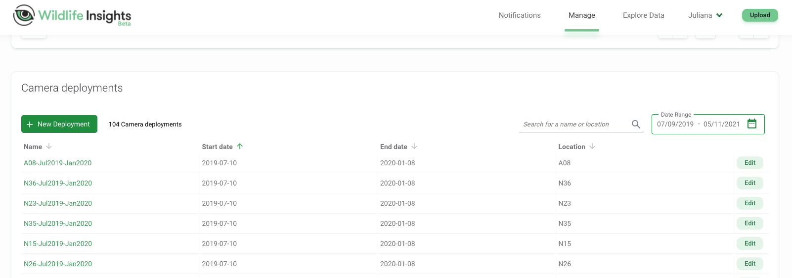
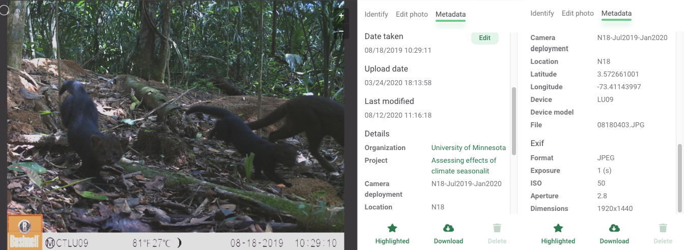
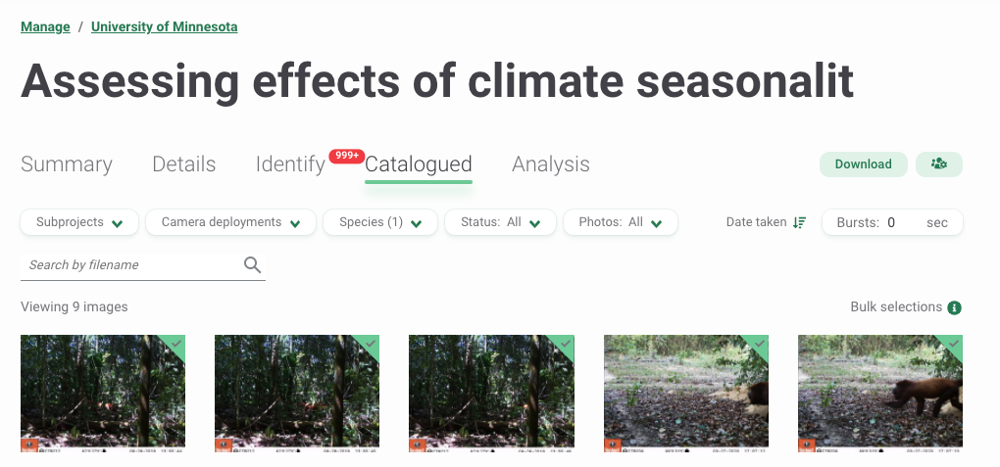
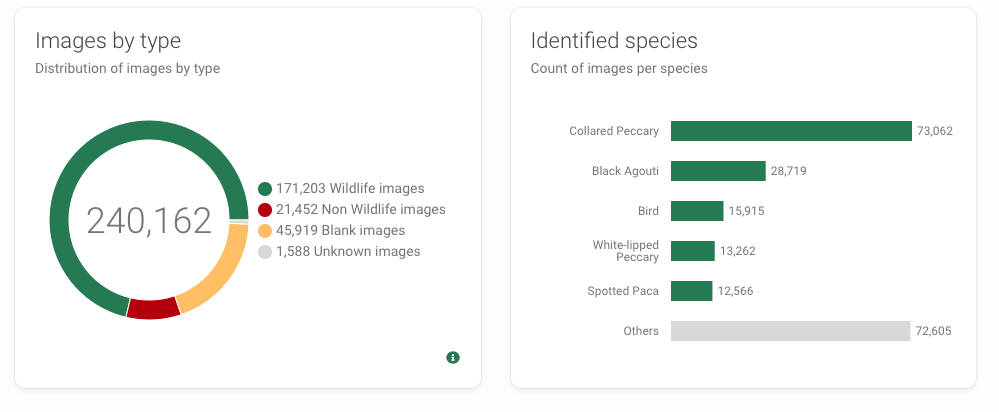
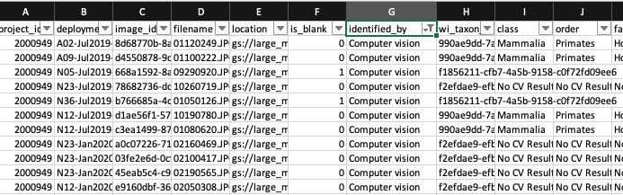
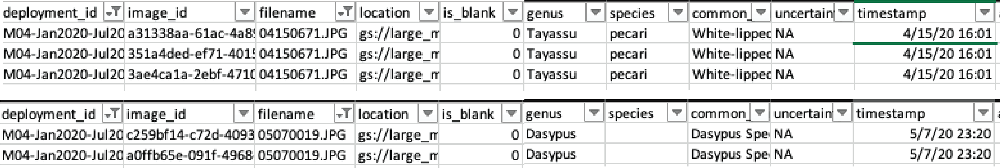
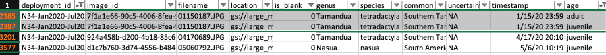

```{r setup2, include=FALSE}
knitr::opts_chunk$set(echo = TRUE)
knitr::opts_chunk$set(message = FALSE, warning = FALSE)
```

# Wildlife Insights

Wildlife Insights (WI) is an initiative developed by Conservation International in partnership with the Wildlife Conservation Society, World Wildlife Fund, Zoological Society of London, The Smithsonian Institution, North Carolina Museum of Natural Sciences, Yale University and Google [@ahumada_wi]. WI provides an interface and tools to support workflows for processing, visualizing, and analyzing camera trap data. These tools include infrastructure to store, review and process images, AI to classify species and blanks, and an analysis engine for implementing common statistical methods with camera trap data (e.g., estimation of species' activity patterns, occupancy, and diversity indices) [@ahumada_wi]. Beyond serving as an interface for image processing and data analysis, WI was also conceived as a data repository for hosting camera trap data collected worldwide; images and associated metadata stored in WI can be downloaded by the public after sensitive content (e.g., images with people or endangered species) has been removed and once an embargo time (maximum 48 months) provided by data providers has passed [@ahumada_wi].

WI provides comprehensive guides for navigating the platform and tutorials showing step-by-step usage of the system's features. This documentation can be found here: <https://www.wildlifeinsights.org/get-started>.  


Additionally, WI provides references describing how their AI models work along with a table listing species used for model training and performance metrics for each species, which users can consult here: <https://www.wildlifeinsights.org/about-wildlife-insights-ai>. We synthesize some of the key navigation steps and illustrate how one can evaluate performance of built-in AI models. Specifically, we provide code for comparing human classifications with model predictions for a subset of your images. This comparison will be useful to better understand how AI models are likely to perform with your particular images and whether AI may be able to provide accurate enough classification for some of your species. 

**Before we get started**: if you plan to compare model predictions with human classifications, you should download computer vision predictions right after uploading images to the WI platform (see Section \@ref(wi-performance)).  It is important that you have a record of the WI predictions **before you do any processing on your data**.  

## Set-up

- Create an account here <https://app.wildlifeinsights.org/join>
- In WI, you can structure your data hierarchically. Below, we provide an example structure from our camera trapping project in Colombia:

  - Organization: University of Minnesota
  - Initiative: Wildlife monitoring in South America using camera traps. 
  - Project: Large mammals Colombia.
  - Subprojects:
      - Jul2019-Jan2020 Deployment
      - Jan2020-Jul2020 Deployment
  - Location: We use alphanumerical codes to name each camera trap location, with letters representing different areas within our study area (Figure \@ref(fig:locations)). Each location has its own geographical coordinates.
  - Deployment: Information for deployments include temporal record (start and end dates) of a camera trap survey within a particular location. In our example, for our location "A08" a camera trap was deployed from 2019-07-10 to 2020-01-08 (Figure \@ref(fig:deployments)).

This data structure allows you to manage multiple collaborators and data sets collected by different organizations and teams but associated with a single purpose [@wi_initiatives]. For example, an "Initiative" allows you to share a project between different organizations [@wi_initiatives] which facilitates data management and labor distribution.

Hierarchical data storage also might help to organize and filter subsets of images or data. For example "Projects" can contain "Subprojects" that might represent groups of deployments and/or locations. See the Glossary page for more terms found in WI <https://www.wildlifeinsights.org/get-started/glossary>.

```{r locations, fig.cap='Locations of camera traps mapped in the Wildlife Insights platform along with location names and geographical coordinates.', out.width='100%', fig.asp=.95, fig.align='center', echo = FALSE}

knitr::include_graphics("input_figures/wi/locations.png")
```

```{r deployments, fig.cap='Deployments showing "Start date" and "End date" for each camera location.', out.width='100%', fig.asp=.75, fig.align='center', echo = FALSE}


```

## Upload/format data 

You can upload already labeled images (e.g., for storing and managing images in the cloud) or unlabeled images to be processed.

- For labeled images, you will need to (re)format images' metadata using the WI batch upload templates and transfer images from a public URL (e.g., Google Drive)  or directly to the Google Cloud Platform. See <https://www.wildlifeinsights.org/get-started/upload/bulk-data-uploads>

- For unlabeled images, you can upload images via the WI platform. Images will then be stored in the Google Cloud Platform and displayed in the user's project. See <https://www.wildlifeinsights.org/get-started/upload/upload-new-data>

## Upload/enter metadata

Metadata, such as the time and date each image was taken and the filename are automatically read once unlabeled images are uploaded.

```{r metadat1-fig, fig.cap='Image metadata displayed after uploading an image to Wildlife Insights online platform.', out.width='85%', fig.asp=.75, fig.align='center', echo = FALSE}


```

You can provide additional metadata, including coordinates for the camera trap or other features associated with camera deployment (e.g., dates, camera height, settings, use of bait, etc.). This information can be entered manually for each deployment or you can use a CSV file formatted using the WI template for a bulk deployment upload. See the deployments guide <https://www.wildlifeinsights.org/get-started/manage-metadata/deployments.> 

## Processing images - AI module

While images are uploaded, they will be processed by WI's AI model. Computer vision predictions will be available in the WI platform as soon as your images are uploaded. Additionally, after images are uploaded, you can download the output (see download tab in the upper right corner of Figure \@ref(fig:wiproject-fig)). The output will include a CSV file with the AI predictions (See Section \@ref(wi-output) for more information on WI output); you will receive an email with a link for downloading the output. **Again, to facilitate evaluation of AI performance, we recommend downloading this CSV file before you do any other manipulations in the WI platform**.

Your project in WI will include the uploaded images in the "Identify" tab. Species predictions will be shown along with their confidence values associated. You will be able to verify if these predictions are correct, after which they will be moved to the "Catalogued" tab (Figure \@ref(fig:wiproject-fig)).

```{r wiproject-fig, fig.cap='WI processing module after uploading images.', out.width='85%', fig.asp=.75, fig.align='center', echo = FALSE}


```

## Post-AI image processing

WI provides a platform with multiple tools for reviewing images, allowing users to verify AI output. In addition, users can: 

- Sort images by "Date taken", "Upload date" or "Last modification" (the latter only for "Catalogued" images) (Figure \@ref(fig:wiproject-fig)).
- Filter images by categories such as Subprojects, Deployments, Species, Status (e.g., Blank or Not blank) or Photos (e.g., Highlighted images for quick access or Not highlighted) (Figure \@ref(fig:wiproject-fig)).
- Edit under- or over-exposed images by adjusting brightness, contrast and saturation.
- Edit identifications using bulk actions by selecting and entering information for multiple images at a time (e.g., for 100 or 200 images).
- Group images within a Burst defined by a time frame to perform bulk actions.
- Manage collaborations for data processing by assigning different roles with different levels of data access (e.g., project owner, editor, contributor, tagger, viewer).

## Using AI output {#wi-output}

All the above mentioned processing tools can be used to review and verify AI output presented in the "Identify" tab. You can approve computer vision predictions or edit them in the processing module. You can also include additional identifications if more than one animal (of the same or different species) is present in the image and add other identifying information (e.g., sex, age, markings for each individual) or other remarks (e.g., comments or observations) that may be useful.

When you download the resulting output, you will receive four different CSV files that capture data related to your cameras, their deployments, and your projects:

- `cameras.csv`: contains metadata related to the cameras, including camera_id, make, model, serial_number and year purchased.
- `deployments.csv`: contains deployment dates, geographical coordinates, details of camera trap placement and camera settings.
- `images.csv`:  includes classifications and features recorded for each image.
- `projects.csv`: includes project details such as project objectives, licenses for metadata and images, and information about the sampling design used for camera trap deployment.

You can quickly inspect AI results in the Summary tab (upper left of Figure \@ref(fig:wiproject-fig)). You will see a map with your camera locations and a summary of the species in your data set (Figure \@ref(fig:wi-summary-fig)).

```{r wi-summary-fig, fig.cap='WI summary of images by type and identified species.', out.width='80%', fig.asp=.75, fig.align='center', echo = FALSE}


```

## Assessing AI performance  {#wi-performance}

AI model performance for classification of camera trap images is still highly variable, both across study sites and species [@tabak_2018]. Thus, it is extremely important to evaluate model performance with your data set. Before reviewing all of your images, you can classify a subset of images and compare these classifications with AI predictions. This step will allow you to determine how well the model is working for various species of interest and also to determine if there are particular species or locations where model performance is particularly poor.

Below, we demonstrate a step-by-step workflow for how to get WI output into R, join computer and human vision identifications, and estimate model performance metrics for each species. Throughout, we will use the `purrr` package in R [@purrr; @R-base] to repeatedly apply the same function to objects in a list or column in a nested data frame efficiently and without the need for writing loops. Readers unfamiliar with `purrr` syntax, may want to view one or more of the tutorials, below, or make use of the [purrr cheat sheet](https://github.com/rstudio/cheatsheets/blob/master/purrr.pdf).

- http://www.rebeccabarter.com/blog/2019-08-19_purrr/
- https://www.r-bloggers.com/2020/05/one-stop-tutorial-on-purrr-package-in-r/
- https://jennybc.github.io/purrr-tutorial/index.html

1. Right after uploading images to the WI platform and ***before*** doing any image processing (i.e., identification), download the WI output. WI's computer vision predictions will be contained in the images.csv file (Figure \@ref(fig:wi-compvision-fig)). Save that file as `images_cv.csv`.
  
```{r wi-compvision-fig, fig.cap='Predictions provided by computer vision.', out.width='80%', fig.asp=.75, fig.align='center', echo = FALSE}


```
  
2. Use the WI processing module to verify a subset of your images (e.g., ~100,000)  and either accept the computer vision prediction as correct or edit the prediction with the correct species label. The `identified_by` column will change according to the new identifier (Figure \@ref(fig:wi-newid-fig)). 

```{r wi-newid-fig, fig.cap='Identifications after verification by an expert.', out.width='90%', fig.asp=.75, fig.align='center', echo = FALSE}

knitr::include_graphics("input_figures/wi/newid.png")
``` 

3. Once you finish identifying a subset of your images, download the data from WI and change the name of the images.csv file to `images_hv.csv`. Create a data folder to store your two CSV files `images_cv.csv` and `images_hv.csv` that refer to classifications of computer and human vision, respectively. We provide an example of both files with the repository associated with this guide, named `images_cv_jan2020_raw.csv` and `images_hv_jan2020_raw.csv`.

4. Process the two data files using the R code provided in the sections below.

### Reading in data, introduction to the Purrr package

Before comparing computer and human vision we need to do some data cleaning. This cleaning includes removing duplicated uploads to the WI platform and making sure to keep a single record for each image, as WI creates multiple rows when more than one animal (or object) is identified in an image.

First, we load required libraries. 
  
```{r libraries, echo =TRUE, warning=FALSE, message=FALSE}
library(tidyverse) # for data wrangling and visualization, includes dplyr and purrr
library(here) # to allow use of relative paths
library(DT) # for viewing data tables
```

Next, we tell R the path (i.e., directory name) that holds our files.  We will use the `here` package [@here] to tell R that our files live in the "./data/wi" directory. You may, alternatively, type in the full path to the file folder or a relative path from the root directory if you are using a project in RStudio. 

```{r filefolder, message=FALSE}
# Create filefolder's path. This should point to the folder name
# where you stored your CSV files downloaded from WI
filesfolder <- here("data", "wi") 
filesfolder
```

Next, we use the `dir` function to list the files contained in the "filesfolder" directory.  
```{r filefolder2, message=FALSE}
files <- dir(filesfolder, pattern = "*.csv") 

files
```

We then use the `map` function in the `purrr` package to read in all of the files and store them in a list object named `mycsv`.  The first argument to `map` is a list (here, `files`) which is "piped in" using `%>%` from the `magrittr` package [@magrittr]. Pipes (`%>%`) provide a way to execute a sequence of data operations, organized so that the operations can be read from left to right (e.g., "Take this set of files and then read them in using `read_csv`"). The second argument to `map` is a function, in this case `read_csv`, to be applied to the list. The `map` function iterates over the two files stored in the `files` object, reads in the data files and then stores them in a new list named `mycsv.` We use `~` to refer to our function and use `.x` to refer to the list object that is passed to the function as an additional argument.   

```{r readdata}
# Read both CSV files
mycsv <- files %>% 
  map(~ read_csv(file.path(filesfolder, .x)))

mycsv 
```


We remove images without a classification (i.e., common_name = "NA"), and with the "Human" and "Vehicle" classes, as these images predominately correspond to camera-set-up images.

```{r}
mycsv <- mycsv %>% 
  map(~.x %>% 
        filter(!is.na(common_name)) %>% 
        filter(!common_name %in% 'Vehicle' & !common_name %in% "Human" & !common_name %in% "Human-Camera Trapper"))
```

### Removing duplicated images 

Before discussing how to join the two data sets corresponding to computer and human vision, we need to remove duplicated rows that might result from accidentally uploading the same image more than once to the WI platform. We can identify these duplicated uploads as they contain the same information in all the columns except for `image_id`. Figure \@ref(fig:wi-duplicated-fig) shows two different examples of duplicated uploads.

```{r wi-duplicated-fig, fig.cap='Duplicated image uploads in the images.csv WI output.', out.width='150%', fig.asp=.75, fig.align='center', echo = FALSE}


``` 

We will use `filename` and `timestamp` as key columns to uniquely identify each image event. To remove duplicates in our data sets, we first use the `group_by` function to group rows using these key columns and store our grouped data frame as `mycsv_grouped`.  We use the `summarise` function [@R-dplyr] to create a new column `uploads` that contains the count of unique `image_id` values for each group of rows. Groups that have more than one `image_id` indicate duplicated uploads (Figure \@ref(fig:wi-duplicated-fig)). We then filter by counts > 1 to inspect duplicated images, remove duplicated rows in our data sets using the `unique` function [@R-base], and store the remaining data in the `no_duplicates` list object.

```{r}

mycsv_grouped <- mycsv %>% 
  map(~.x %>% 
  group_by(filename, timestamp))

# Create data set with duplicated images
duplicated_images <- mycsv_grouped %>%
  map(~.x %>% 
  summarise(uploads = length(unique(image_id))) %>% # count unique ID's
    filter(uploads > 1)) # for inspecting duplicated uploads

# Create a data set without the duplicated images
no_duplicates <- mycsv_grouped %>% 
  map(~.x %>% 
  filter(image_id == unique(image_id)[1])) 
```

### Images with multiple observations of the same species

WI creates extra rows when you identify more than one animal per image. Thus, it is likely that your two CSV files will differ in number of rows. After removing duplicated records, we need to drop extra rows in the human vision data frame that result from identifying more than one animal of the same species in the same image. As an example, Figure \@ref(fig:wi-distinct-dets-fig) displays records for both a juvenile and adult Southern tamandua detected in the same image. 

```{r wi-distinct-dets-fig, fig.cap='Highlighted rows represent detections of one juvenile and an adult of the Southern Tamandua in the same image.', out.width='150%', fig.asp=.75, fig.align='center', echo = FALSE}


``` 

There are many variables that we will not need when evaluating AI performance. We use the select function to only keep the variables of interest:

- `filename`: image filename.
- `timestamp`: time of a camera trigger.
- `image_id`: WI identifier for images uploaded to the platform. 
- `common_name`: species' common name labeled either by computer or human vision.
- `cv_confidence`: confidence value associated with the computer vision label.

We regroup the data by filename, adding `common_name`. We then apply the `distinct` function to reduce multiple records of the same species in the same image to a single record. If the same filename has multiple rows corresponding to a species and a "Blank" label, we only keep the species classification.


```{r}
no_duplicates <- no_duplicates %>% 
  map(~.x %>% 
        select(filename, timestamp, image_id, common_name, cv_confidence))

hv <- no_duplicates %>% 
  pluck(2) %>% 
        group_by(filename, common_name) %>%
        distinct(filename, common_name, .keep_all = TRUE) %>% # keep single record for same filename and common_name
        group_by(filename) %>% 
        mutate(sp_num = length(unique(common_name))) %>% 
        group_by(filename) %>% 
        filter(!(common_name == "Blank" & sp_num > 1)) # for groups with num_classes > 1, remove blanks
```

We will use the human vision data set contained in the `hv` object as the ground truth when evaluating model performance for all platforms reviewed in this GitBook. This object has been saved as `images_hv_jan2020.csv` using the following code.

```{r, eval = FALSE}
write_csv(hv %>% select(-cv_confidence), file = here("data", "md", "images_hv_jan2020.csv"))
write_csv(hv %>% select(-cv_confidence), file = here("data", "mlwic2", "images_hv_jan2020.csv"))
```


For a filename with multiple predictions of the same `common_name` in computer vision, we only keep the record with the highest confidence value using the `top_n` function. We also create a `sp_num` column, which can then be used to identify records with more than one species in an image `sp_num > 1`.

```{r}
cv <- no_duplicates %>% 
  pluck(1) %>% 
        group_by(filename, common_name) %>%
        top_n(1, cv_confidence) %>% # keep highest value of same class
        group_by(filename, common_name) %>%
        distinct(filename, common_name, cv_confidence, .keep_all = TRUE) # keep single record for same filename, common_name and value
```


```{r}
cv <- cv %>% 
        group_by(filename) %>% 
        mutate(sp_num = length(unique(common_name))) %>% 
        group_by(filename) %>% 
        filter(!(common_name == "Blank" & sp_num > 1)) %>% # for groups with num_classes > 1, remove blanks
        mutate(sp_num = length(unique(common_name))) # re-estimate sp_num with no blanks

```

### Merging computer and human vision data sets

Now that we removed duplicated uploads and kept a single record for multiple animals of the same species in an image, we can use various "joins" [@R-dplyr] to merge computer and human vision together so that we can evaluate the accuracy of WI. First, however, we will eliminate any images that were not processed by both humans and AI.

```{r}
# Determine which images have been viewed by both methods
ind1 <- cv$filename %in% hv$filename # in both
ind2 <- hv$filename %in% cv$filename # in both

cv <- cv[ind1,] # eliminate images not processed by human vision
hv <- hv[ind2,] # eliminate images not processed by computer vision

# Number of photos eliminated
sum(ind1 != TRUE) # in computer vision but not in hv
sum(ind2 != TRUE) # in human vision but not in cv
```

Now, we can use:

- an `inner_join` with `filename` and `common_name` to determine images that have correct predictions (i.e., images with the same class assigned by computer and human vision)
- an `anti_join` with `filename` and `common_name` to determine which records in the human vision data set have incorrect predictions from computer vision.
- an `anti_join` with `filename` and `common_name` to determine which records in the computer vision data set have incorrect predictions. 

We assume the classifications from human vision to be correct and distinguish them from WI predictions. The WI predictions will be correct if they match a class assigned by human vision for a particular record and incorrect if the classes assigned by the two visions differ.

```{r}
# correct predictions
matched <- cv %>% inner_join(hv, by = c("filename", "common_name"), 
                suffix = c("_cv", "_hv")) %>%
        mutate(class_hv = common_name) %>%
        mutate(class_cv = common_name) 

# incorrect predictions in hv set
hv_only <- hv %>% anti_join(cv,
                by = c("filename", "common_name"), 
                suffix = c("_hv", "_cv")) %>%
        rename(class_hv = common_name) %>%
        rename(multiple_det_hv = sp_num)

# incorrect predictions in cv set
cv_only<- cv %>% anti_join(hv, 
               by = c("filename", "common_name"), 
               suffix = c("_cv", "_hv")) %>%
        rename(class_cv = common_name) %>%
        rename(multiple_det_cv = sp_num)

```

We then use `left_join` to merge the predictions from the `cv_only` (computer vision) data set onto the records from the `hv_only` (human vision) data set.

```{r}
hv_mismatch <- hv_only %>% left_join(cv_only,
                    by = "filename",
                    suffix = c("_hv", "_cv")) 

```

We combine the matched and mismatched data sets. Then, we set a 0.65 confidence threshold to assign WI predictions and evaluate model performance.

```{r join visions}

both_visions <- rbind(matched, hv_mismatch)

both_visions_65 <- both_visions
both_visions_65$class_cv[both_visions_65$cv_confidence_cv < 0.65] <- "No CV Result" 

```


### Confusion matrix and performance measures 

Using the `both_visions_65` data frame, we can estimate a confusion matrix using the `confusionMatrix` function from the `caret` package [@R-caret]. The `confusionMatrix` function requires a data argument of a table with predicted and observed classes, both as factors and with the same levels. We use the `factor` function [@R-base] to convert class names into factor classes. We specify `mode = "prec_recall"` when calling the `confusionMatrix` function [@R-caret] to estimate the precision and recall for the WI classifications.

```{r out.width= "100%"}
library(caret) # to inspect model performance
library(ggplot2) # to plot results


all_class <- union(both_visions_65$class_cv, both_visions_65$class_hv)
cm_wi <- table(factor(both_visions_65$class_cv, all_class),
               factor(both_visions_65$class_hv, all_class)) # table(pred, truth)
cm_wi <- confusionMatrix(cm_wi, mode="prec_recall")
```

We then group the data by `class_cv` and`class_hv` and count the number of observations using `n()` inside `summarise`. Then, we filter classes with at least 20 records and use the `intersect` function to get the pool of classes shared in the output of computer and human vision. Finally, we keep records containing classifications at the species level, but the confusion matrix and model performance metrics can also be estimated for higher taxonomic levels.

```{r species counts}

class_num_cv <- both_visions_65 %>% group_by(class_cv) %>% 
                               summarise(n = n()) %>% 
                               filter(n >= 20) %>% 
                               pull("class_cv") %>% 
                               unique()
class_num_hv <- both_visions_65 %>% group_by(class_hv) %>% 
                               summarise(n = n()) %>% 
                               filter(n >= 20) %>% 
                               pull("class_hv") %>% 
                               unique()

(class_num <- intersect(class_num_cv, class_num_hv))

```

Collared peccary, domestic horse and puma are the species shared in the output of computer and human vision, and with at least 20 records in each data set.

```{r}
sp_num <- class_num[class_num %in% c("Collared Peccary", "Domestic Horse", "Puma")]
```


Now we can use the confusion matrix to estimate model performance metrics including accuracy, precision, recall and F1 score (See Chapter [1][Introduction] for metrics description).

```{r wi-metrics}

(overall_accuracy <- cm_wi %>% 
  pluck("overall", "Accuracy") %>% 
  round(., 2))

classes_metrics <- cm_wi %>% 
  pluck("byClass") %>%
  as.data.frame() %>% 
  select(Precision, Recall, F1) %>% 
  rownames_to_column() %>% 
  rename(species = rowname) %>% 
  mutate(species = str_remove(species, pattern = "Class: ")) %>% 
  filter(species %in% sp_num) %>% 
  mutate(across(is.numeric, ~round(., 2)))
```


```{r wi-metrics-tab, echo=FALSE, warning=FALSE, results="asis"}
library(huxtable)
library(DT)
library(knitr)

if(is_html_output()==TRUE){
options(width=180)
datatable(classes_metrics)
}
cat("<table>",paste0("<caption>", "(#tab:wi-metrics-tab)",  "Model performance metrics for species shared by computer and human vision, and with at least 20 records in each data set. We used a confidence threshold of 0.65 for determining the classifications.", "</caption>"),"</table>", sep ="\n")
```

### Confidence thresholds

Finally, we define a function that allows us to inspect how precision and recall change when different confidence thresholds are used for assigning a prediction made by computer vision. Our function will assign a "No CV Result" label whenever the confidence for a computer vision prediction is below a user-specified confidence threshold. Higher thresholds should reduce the number of false positives but at the expense of more false negatives. We then estimate the same performance metrics for the specified confidence threshold.  By repeating this process for several different thresholds, users can evaluate how precision and recall for each species change with the confidence threshold and identify a threshold that balances precision and recall for the different species.


```{r}

threshold_for_metrics <- function(conf_threshold = 0.7) {
  df <- both_visions
  df$class_cv[df$cv_confidence_cv < conf_threshold] <- "No CV Result" 
  
  all_class <- union(df$class_cv, df$class_hv)
  newtable <- table(factor(df$class_cv, all_class), factor(df$class_hv, all_class)) # table(pred, truth)
  cm <- confusionMatrix(newtable, mode="prec_recall")
  
  # metrics
  classes_metrics <- cm %>% # get confusion matrix
    pluck("byClass") %>% # get metrics by class
    as.data.frame() %>% # assign a data frame object
    select(Precision, Recall, F1) %>% # select metrics of interest
    rownames_to_column() %>% # format data frame
    rename(class = rowname) %>% # rename class column
    mutate(conf_threshold = conf_threshold)
  classes_metrics$class <- str_remove(string = classes_metrics$class,
                                      pattern = "Class: ") 
  
  return(classes_metrics) # return a data frame with metrics for every class
}


```


Let's look at the distribution of confidence values associated with each species using the `geom_bar` function [@R-ggplot2]. 

```{r fig.height=5, fig.width=9, fig.cap="Distribution of confidence values associated with species shared by computer and human vision, and with at least 20 records in each data set."}
# Plot confidence values 
both_visions %>% 
  filter(class_cv %in% sp_num & class_hv %in% sp_num)  %>%
  ggplot(aes(cv_confidence_cv, group = class_cv, colour = class_cv)) +
  geom_bar() + 
  facet_wrap(~class_cv, scales = "free") +
  labs(y = "Empirical distribution", x = "Confidence values")+
  theme(legend.position="bottom") +
  scale_color_viridis_d()


```
We can see that the distribution of confidence values is left skewed for all the species with most records having high confidence values, suggesting that the AI predictions are presumed to be correct most of the time.

Let's estimate model performance metrics for confidence values ranging from 0.1 to 0.99 using the map_df function [@purrr] . The map_df function [@purrr] returns a data frame object. Once we get a data frame of model performance metrics for a range of confidence values, we can plot the results using the `ggplot2` package [@R-ggplot2].  

```{r, message=FALSE,warning=FALSE}
conf_vector = seq(0.1, 0.99, length=100)
metrics_all_confs <- map_df(conf_vector, threshold_for_metrics)

```

```{r thresholds, out.width="100%", fig.width=9, fig.height=5, fig.cap="Precision and recall for different confidence thresholds for species shared by computer and human vision, and with at least 20 records in each data set. Point sizes represent the confidence thresholds used to accept AI predictions.", message=FALSE,warning=FALSE}

# Plot Precision and Recall

prec_rec_wi <- metrics_all_confs %>% 
  mutate_if(is.numeric, round, digits = 2) %>% 
  filter(class %in% sp_num) %>%
  rename(Species = class, `Confidence threshold` = conf_threshold) %>% 
  ggplot(aes(x = Recall, y = Precision, group = Species, colour = Species)) +
  geom_point(aes(size = `Confidence threshold`)) +
  scale_size(range = c(0.01,3)) +
  geom_line() + 
  scale_color_viridis_d() +
  xlim(0, 1) + ylim(0, 1) 

prec_rec_wi

```

We see that as we increase the confidence threshold, precision usually increases and recall decreases (Figure \@ref(fig:thresholds)). Ideally, we would like AI to have high precision and recall, though the latter is likely to be more important in most cases. Remember that precision tells us the probability that the species is truly present when AI identifies the  species as being present in an image (Chapter [1][Introduction]). If AI suffers from low precision, then we may have to manually review photos that AI tags as having species present in order to remove false positives.  Recall, on the other hand, tells us how likely AI is to find a species in the image when it is truly present.  If AI suffers from low recall, then it will miss many photos containing images of species that are truly present. To remedy this problem, we would need to review images where AI says the species is absent in order to reduce false negatives. For this particular data set, AI would be most useful for classifying domestic horses and pumas. For example, we can be confident that WI is correctly labeling domestic horse, with a precision of `r round(classes_metrics[2,2], 2)*100`% at a `r round(classes_metrics[2,3]*100, 2)`% recall, using a 0.65 confidence threshold (Table \@ref(tab:wi-metrics-tab)). We can also be confident that WI is correctly labeling pumas with a precision of `r round(classes_metrics[3,2], 2)*100`%, and it will help us to spot `r round(classes_metrics[3,3], 2)*100`% of the actual records for the species, also using a 0.65 confidence threshold. Yet, the low to moderate recall for these species suggests that we will still have to review all images to identify other records of animals that are not detected by WI.

## Conclusions

We have seen how to set up a project, upload and process camera trap photos using WI's platform. WI provides an infrastructure for data organization and management, features for image review and annotation, and facilitates collaborative work through a multi-user environment. WI also serves as an image repository and provides advanced reporting and analytical capabilities.

We provided R code for evaluating per-species model performance. Although we found that WI was able to classify some species with high levels of precision, recall values were typically low; thus, experts will still need to review images to find the animals missed by computer vision. Projects incorporating AI in their workflows would benefit from examining a range of confidence thresholds to determine how they impact precision and recall for classification of different species.

