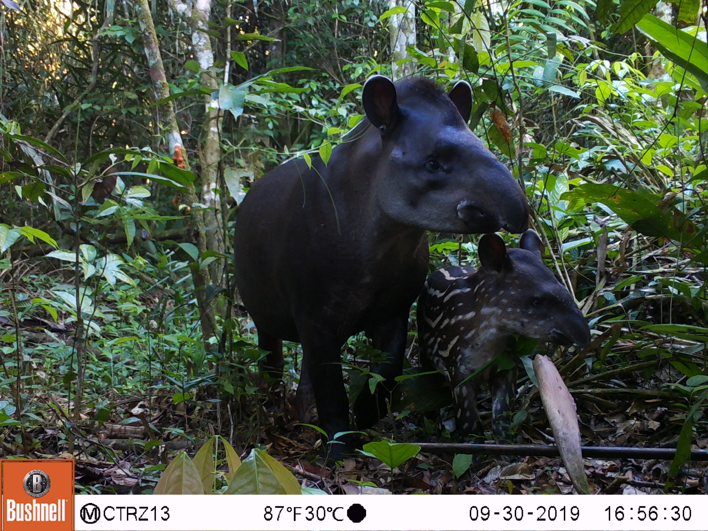
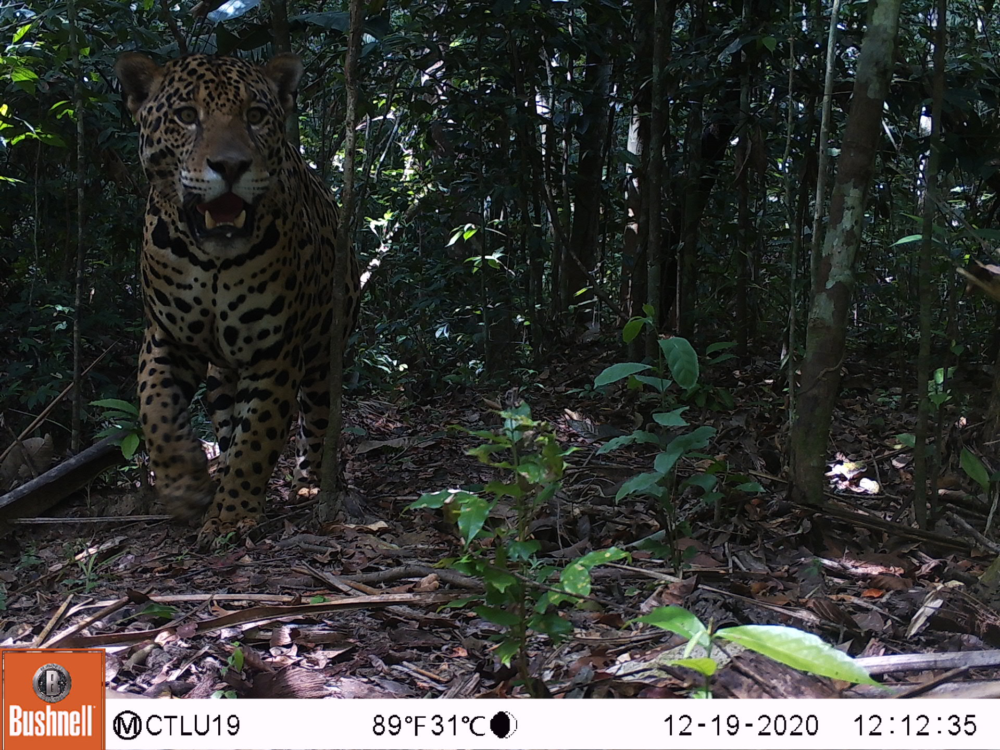
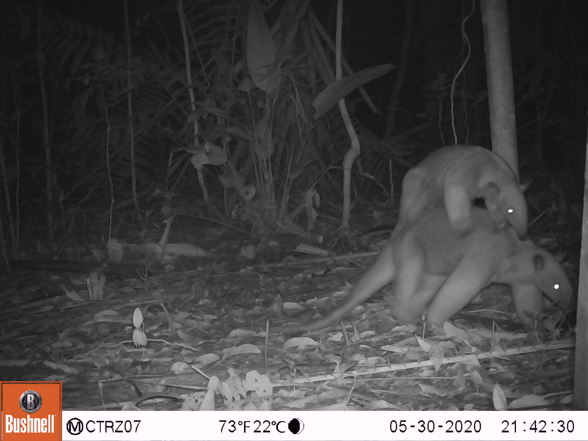
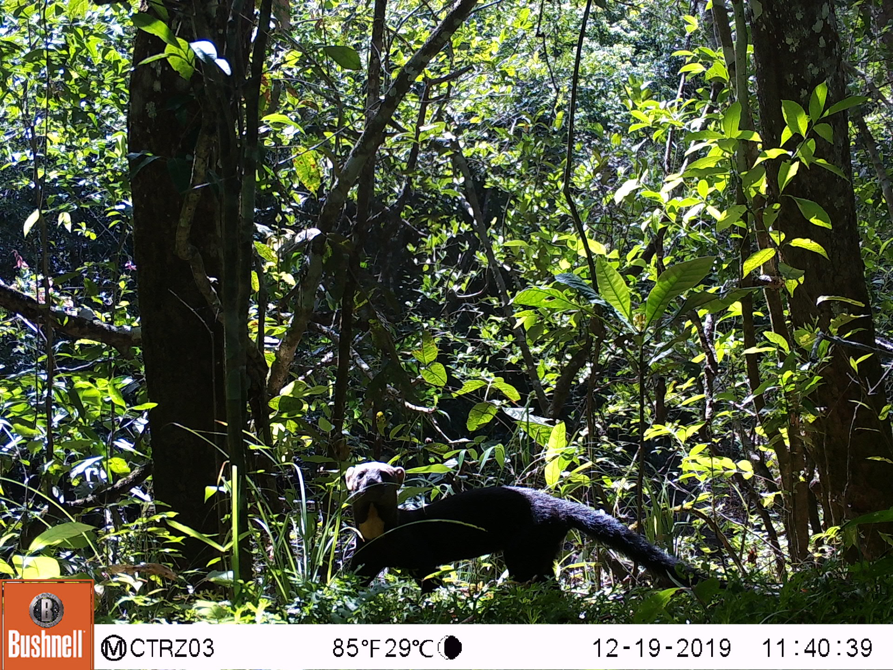
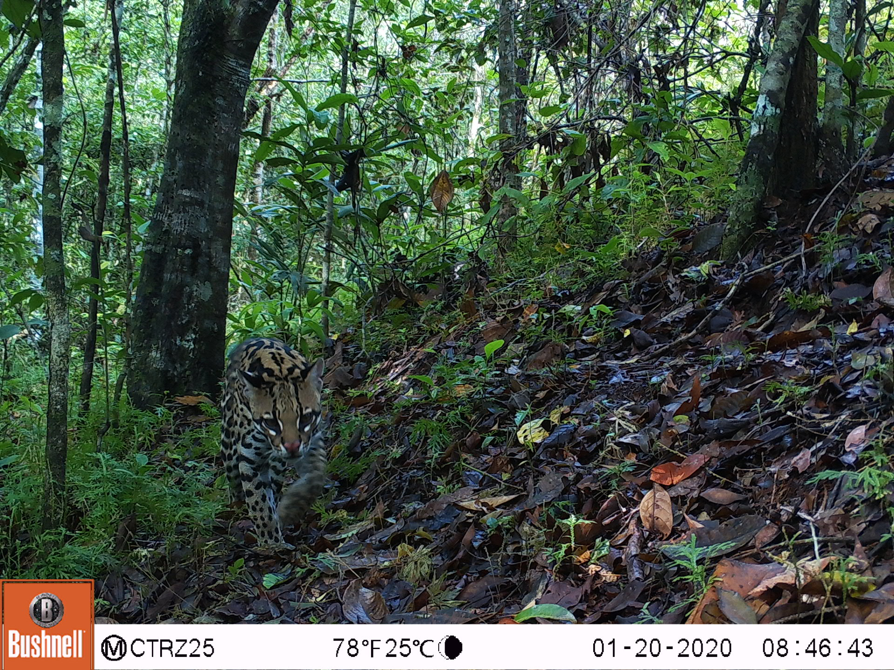

# Camera-trap data

We evaluated model performance using data from a camera trap survey performed from January - July 2020 for wildlife detection within the private natural reserves El Rey Zamuro (31 km2) and Las Unamas (40 km2), located in the Meta department in the Orinoquia region in central Colombia. During the survey period, we collected 112,247 images from a 50-camera-trap array, with cameras spaced 1-km apart; 20 percent of the images were blank and 80 percent contained at least one animal. Images were stored and reviewed by experts using the WI platform. WI was chosen because it provides advanced processing capabilities that helped to accelerate image review (e.g., multiple image selection, image editing and infrastructure for collaborative data processing).  Expert (i.e., human vision) labels were compared to classifications by computer vision derived from AI models associated with WI (downloaded in February 2021), MD (version 4.1) and MLWIC2 (version 1.0) platforms to determine how well these models would perform when applied to data that were not included in the training data set. Records containing the "Human" class were removed from the data set; these were predominately associated with images during camera setup.

(\#fig:ctimages)Camera trap images collected in the reserves El Rey Zamuro and Las Unamas, located in the Meta department in central Colombia.

