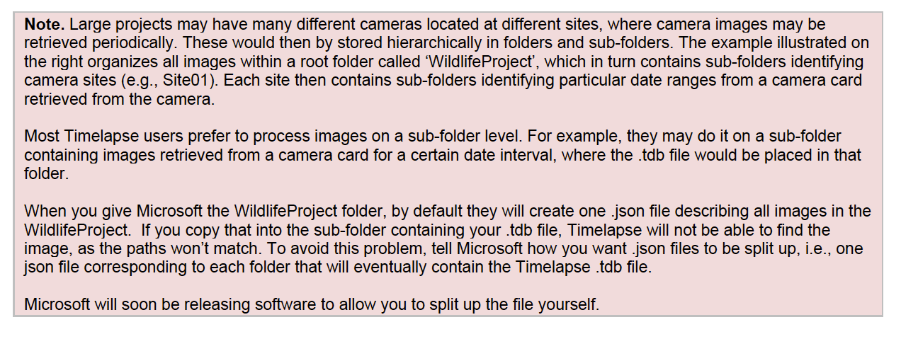
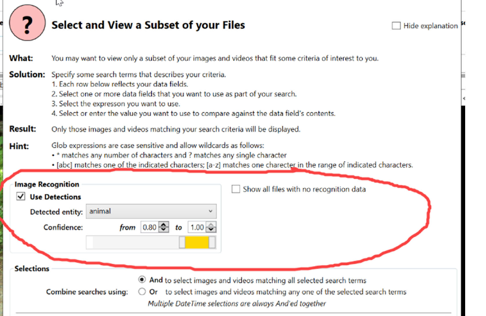
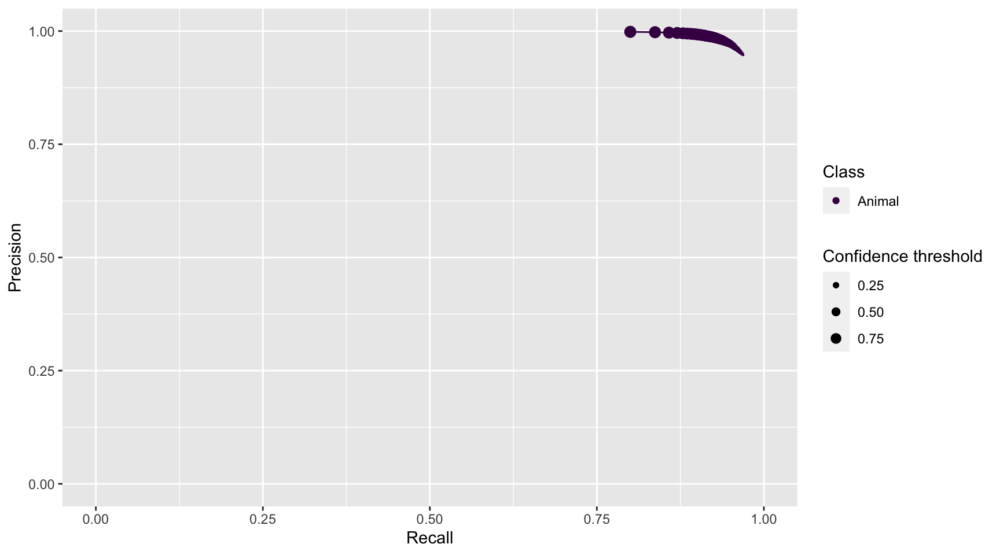
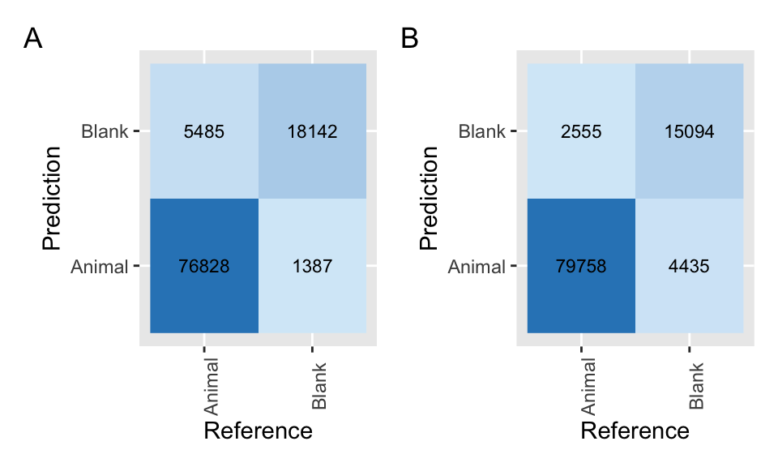

# MegaDetector - Microsoft AI

The [MegaDetector (MD)](https://github.com/microsoft/CameraTraps/blob/master/megadetector.md) model detects objects (animals, people, and vehicles) in camera trap images, and can be used to separate images into categories of "Empty", "Animal", "Human" and "Vehicles" [@beery2019efficient]. You can run MD on your own or request assistance from the Microsoft AI for Earth team. To choose one of these options, you can contact a member of the Microsoft AI team at cameratraps@lila.science to see which approach is right for you; this decision will depend on the number of images that you have, whether data can be shared with third parties, and how comfortable you are running Python code [@beery2019efficient]. We will describe a workflow for a user that will submit images to the Microsoft AI for Earth team.  A member of the Microsoft AI for Earth team will then run the models and return an output file that can be loaded into the image review software [Timelapse 2](http://saul.cpsc.ucalgary.ca/timelapse/pmwiki.php?n=Main.Download2) [@greenberg-design]. Sections \@ref(md-upload)-\@ref(md-process) go through the steps required to run MD and interpret its output. Sections \@ref(md-timelapse) and \@ref(md-output) focus on how MD output can be processed in Timelapse 2 and how AI output can be used to accelerate image review and identification by humans. Specifically, AI identifications with high confidence values (i.e., likely to be correct) can be filtered, subset, and subsequently identified by humans using batch operations (see Section \@ref(md-output)). Section \@ref(md-performance) focuses on assessing the performance of MD by comparing human labels with the ones provided by MD for a set of images. This last section is particularly useful as it provides tools to evaluate how MD performs with specific data sets and guidance to understand differences in MD output when you use different confidence thresholds for assigning predictions.

## Upload/format data {#md-upload}

To use MD you can choose between running the model on your own or contacting a member of the Microsoft AI for Earth team at cameratraps@mlila.science to help you run the model. For the first option you won’t need to write any code, but you will need to be comfortable running commands at the command line. If you choose the second option, the Microsoft AI for Earth team will create a [Microsoft Azure Blob Storage](https://azure.microsoft.com/en-us/services/storage/blobs/) container for you, to which you will upload your images.  You will typically upload your images using [AzCopy](https://docs.microsoft.com/en-us/azure/storage/common/storage-use-azcopy-v10), a command-line utility for batch data transfers, or [Azure Storage Explorer](https://azure.microsoft.com/en-us/features/storage-explorer), a GUI-based utility for working with Azure Storage.  The team will provide more specific instructions when you contact them.

## Upload/enter metadata {#md-metadata}

When using MD, there is no need to enter metadata before processing your data using AI. You will enter metadata during the post-AI image processing stage, when MD output is integrated with other image processing tools such as [Timelapse 2](http://saul.cpsc.ucalgary.ca/timelapse/pmwiki.php?n=Main.Download2) or [Camelot](https://camelot-project.readthedocs.io/en/latest/introduction.html).

## Process images - AI module {#md-process}

The Microsoft AI for Earth team will run models for you and return a JSON file or a CSV file if requested. This file will contain  image filenames (e.g., "A01/01020108.JPG", where A01 represents the subfolder of a camera trap location and 01020108.JPG is the picture filename), maximum confidence values associated with all detections within an image, and the maximum confidence value for each category (animal, person, or vehicle) (Figure \@ref(fig:md-compvision-fig)).

<div class="figure" style="text-align: center">

<p class="caption">(\#fig:md-compvision-fig)Identifications provided by Megadetector.</p>
</div>

## Image processing with Timelapse 2 {#md-timelapse}

This section synthesize general features of Timelapse 2 that facilitate species identification and annotation of other features of interest from the images (e.g., animals' sex, behavior, condition, etc.). Section \@ref(md-output) demonstrates how you can incorporate AI output (i.e., the JSON file) in Timelapse 2, to accelerate image review and identification.

To run Timelapse 2, you will need a computer running Microsoft Windows, and your images must be organized in subfolders (e.g., by study area and camera trap location; Figure \@ref(fig:md-subfolders)). Timelapse 2 software, video tutorials and a detailed manual with all the software features explained can be downloaded here: <http://saul.cpsc.ucalgary.ca/timelapse/pmwiki.php?n=Main.Download2>

<div class="figure" style="text-align: center">

<p class="caption">(\#fig:md-subfolders)Organization of images folders and subfolders appropriate for Timelapse 2 [@greenberg-timelapse].</p>
</div>

Before using Timelapse 2, you will need to create a data schema (i.e., a template with a .tdb file extension) that identifies the data fields that will be recorded when processing your camera trap data (e.g., species name, sex, behavior, etc.). This step can be accomplished by using the Timelapse Template Editor that is downloaded along with Timelapse 2. The Template Editor allows you to create the .tdb file that will be read in Timelapse 2 and will adjust the software image processing interface to capture the different data fields you specify in the .tdb file [@greenberg-timelapse].

Once photos are imported to Timelapse 2, you can review them using different processing tools provided by the software. The Timelapse 2 manual [@greenberg-timelapse] and documentation about the software design [@greenberg-design] describe in detail the processing tools available in the software, which include features to:

  - Magnify images and explore image difference extraction tools (e.g., to identify small animals that are otherwise difficult to spot).
  - Select multiple images quickly from small thumbnails and classify them all at once.
  - Automate data entry via metadata extraction (time/date, filename, temperature sensed by the camera) and copy annotated information to other pictures.
  - Sort images by date, species or any other annotated feature, to easily review and verify this information.

## Using AI output {#md-output}

To integrate MD output with Timelapse 2, you will need to have the same folder and subfolder structure (Figure \@ref(fig:md-subfolders)) that you used to upload pictures to the Azure Blob Storage. Using the same folder structure allows Timelapse 2 to match each image with MD output using relative paths associated with each filename (see notes in Figure \@ref(fig:md-matchingpaths)).

<div class="figure" style="text-align: center">

<p class="caption">(\#fig:md-matchingpaths)Notes from the Timelapse 2 manual on how to match MD output with photos when using the Timelapse 2 software [@greenberg-timelapse]</p>
</div>

In Timelapse 2, you must activate the option for working with image recognition data (Figure \@ref(fig:md-imagerecognition) and import computer vision results stored in the JSON file provided by Microsoft AI team [@greenberg-timelapse]. You will see bounding boxes that can facilitate image review once the automatic image recognition is activated. 

To use AI results to accelerate image review, you can filter MD output categories detected with high confidence levels that are likely correct. To do that, you must provide a confidence range to accept predictions made by computer vision (Figure \@ref(fig:md-imagerecognition) and Figure \@ref(fig:md-confidence-value)). For example, if you choose "Empty" as the detected entity and a high confidence range (e.g, from 0.65 to 1.00), your data set will be filtered to display images identified as "Empty" by AI and whose predictions are likely to be correct.

<div class="figure" style="text-align: center">

<p class="caption">(\#fig:md-imagerecognition)Section of "Custom selection" from the Timelapse 2 software where the option to work with AI detections can be activated [@greenberg-timelapse].</p>
</div>

<div class="figure" style="text-align: center">

<p class="caption">(\#fig:md-confidence-value)When activating the use of AI detections, users can filter which images are displayed depending on the range of confidence values provided [@greenberg-timelapse].</p>
</div>

After subsetting images to be displayed depending on their confidence values, you can easily inspect images in the overview mode in Timelapse 2 and select multiple images at a time and assign an "Empty" category to them if the AI output is correct (Figure \@ref(fig:md-overview-timelapse)). If AI output is not correct, you can edit those classifications.

<div class="figure" style="text-align: center">

<p class="caption">(\#fig:md-overview-timelapse)Timelapse 2 overview mode where users can perform bulk actions (e.g., selection of multiple images) to accept or reject AI predictions [@greenberg-timelapse].</p>
</div>

After, processing pictures with Timelapse 2, you can export the data as a CSV File. This file (`TimelapseData.csv`) will contain all the data entries that you specified in the template (Figure \@ref(fig:output-timelapse)).

<div class="figure" style="text-align: center">

<p class="caption">(\#fig:output-timelapse)Output contained in a CSV file exported from Timelapse 2 software [@greenberg-timelapse].</p>
</div>

## Assessing AI performance {#md-performance}

Before exploring model performance with your data, let us recapitulate. MD runs AI models and outputs broad categories of predictions for images (in a JSON file). These AI predictions can be integrated with Timelapse 2 to further process camera trap images (i.e., identifying pictures with the help of AI output). However, if you have previously classified images (e.g., identified using your software or platform of preference), you can explore MD performance before integrating AI results using Timelapse 2. 

To evaluate MD performance, you will need to 1) classify a subset of your pictures and export the classification results to a CSV file (containing at minimum, the image filename, camera location and species name), and 2) request the Microsoft AI team to run MD (if you decide not to run the models by yourself) and send the results as a CSV file. You can then follow the steps  below to evaluate the performance of MD's AI model. We also discuss how one can select an appropriate confidence threshold for filtering images  to accelerate the image review process (e.g., by focusing only on images that likely contain an animal). 

### Reading in data, introduction to the Purrr package

Below, we demonstrate a step-by-step workflow for how to get MD output into R, join computer and human vision identifications, and estimate model performance metrics for each class. Throughout, we will use the `purrr` package in R [@purrr; @R-base] to repeatedly apply the same function to objects in a list or column in a nested data frame efficiently and without the need for writing loops. Readers unfamiliar with `purrr` syntax, may want to view one or more of the tutorials, below, or make use of the [purrr cheat sheet](https://github.com/rstudio/cheatsheets/blob/master/purrr.pdf).

- http://www.rebeccabarter.com/blog/2019-08-19_purrr/
- https://www.r-bloggers.com/2020/05/one-stop-tutorial-on-purrr-package-in-r/
- https://jennybc.github.io/purrr-tutorial/index.html

1. Once you finish the identification of a subset of your images using your platform of preference, export your classifications as a CSV file and name it as `images_hv.csv`. The other CSV file containing the MD results can be named as `images_cv.csv`.

2. Create a data folder to store your two CSV files `images_cv.csv` and `images_hv.csv` that refer to classifications of computer and human vision, respectively (note, we provide an example of both files with the repository associated with this guide named `images_cv_jan2020.csv` and `images_hv_jan2020.csv`).

3. Process the two data files using the R code provided below.

First, we load required libraries and open files. 
  

```r
library(tidyverse) # for data wrangling and visualization, includes dplyr and purrr
library(here) # to allow use of relative paths
```

Next, we tell R the path (i.e., directory name) that holds our files.  We will use the `here` package [@here] to tell R that our files live in the "./data/md" directory. You may, alternatively, type in the full path to the file folder or a relative path from the root directory if you are using a project in Rstudio. 


```r
# Create filefolder's path. This should point to the folder name
# where you stored your CSV files, one with classifications of some of your pictures
# and the other with MD output
filesfolder <- here("data", "md") 
filesfolder
```

```
## [1] "/Users/julianavelez/Documents/GitHub/Processing-Camera-Trap-Data-using-AI/data/md"
```

```r
# List your files contained in the filesfolder directory. This code will
# list all your CSV files (i.e., images_cv.csv and images_hv.csv)
files <- dir(filesfolder, pattern = "*.csv") 
files
```

```
## [1] "images_cv_jan2020.csv" "images_hv_jan2020.csv"
```

We then use the `map` function in the `purrr` library to read in all of the files and store them in a list object named `mycsv`.  The first argument to `map` is a list (here, `files`) which is "piped in" using `%>%` from the `magrittr` package [@magrittr]. Pipes (`%>%`) provide a way to execute a sequence of data operations, organized so that the operations can be read from left to right (e.g., "Take the set of files and then read them in using `read_csv`"). The second argument to `map` is a function, in this case `read_csv`, to be applied to the list. The `map` function iterates over the two files stored in the `files` object, reads in the data files and then stores them in a new list named `mycsv.`  We use `~` to refer to our function and use `.x` to refer to the list object that is passed to the function as an additional argument.   


```r
# Read both CSV files
mycsv <- files %>% 
  map(~read_csv(file.path(filesfolder, .x)))

# Inspect how the data sets look like
mycsv 
```

```
## [[1]]
## # A tibble: 112,247 × 7
##    image_path               max_confidence detections max_conf_animal max_conf_person
##    <chr>                             <dbl> <lgl>                <dbl>           <dbl>
##  1 jan2020/A01/01080001.JPG          0.998 NA                  NA               0.998
##  2 jan2020/A01/01080002.JPG          0.97  NA                  NA               0.97 
##  3 jan2020/A01/01080003.JPG          0.996 NA                  NA               0.996
##  4 jan2020/A01/01080004.JPG          0.985 NA                   0.202           0.985
##  5 jan2020/A01/01080005.JPG          0.939 NA                   0.209           0.939
##  6 jan2020/A01/01080006.JPG          0.996 NA                  NA               0.996
##  7 jan2020/A01/01080007.JPG          0.999 NA                  NA               0.999
##  8 jan2020/A01/01080008.JPG          0.997 NA                  NA               0.997
##  9 jan2020/A01/01080009.JPG          0.914 NA                   0.428           0.914
## 10 jan2020/A01/01080010.JPG          0.992 NA                  NA               0.992
## # … with 112,237 more rows, and 2 more variables: max_conf_group <dbl>,
## #   max_conf_vehicle <lgl>
## 
## [[2]]
## # A tibble: 104,826 × 4
##    deployment_id       filename     timestamp           common_name 
##    <chr>               <chr>        <dttm>              <chr>       
##  1 A01-Jan2020-Jul2020 01090079.JPG 2020-01-09 10:54:39 Blank       
##  2 A01-Jan2020-Jul2020 01090080.JPG 2020-01-09 10:54:40 Blank       
##  3 A01-Jan2020-Jul2020 01090081.JPG 2020-01-09 10:54:41 Blank       
##  4 A01-Jan2020-Jul2020 01090082.JPG 2020-01-09 10:54:49 Blank       
##  5 A01-Jan2020-Jul2020 01090083.JPG 2020-01-09 10:54:50 Blank       
##  6 A01-Jan2020-Jul2020 01090084.JPG 2020-01-09 10:54:51 Blank       
##  7 A01-Jan2020-Jul2020 01100085.JPG 2020-01-10 16:14:15 Black Agouti
##  8 A01-Jan2020-Jul2020 01100086.JPG 2020-01-10 16:14:16 Blank       
##  9 A01-Jan2020-Jul2020 01100087.JPG 2020-01-10 16:14:17 Black Agouti
## 10 A01-Jan2020-Jul2020 01130088.JPG 2020-01-13 08:53:39 Blank       
## # … with 104,816 more rows
```
 

### Format computer vision data set

Columns of interest in the the MD data set include:

- `filename`: contains camera location and filename (e.g., A01/01010461.JPG).
- `max_confidence`: contains the maximum confidence value found for a detection in a picture.
- `max_conf_animal`, `max_conf_person`, `max_conf_group`, `max_conf_vehicle`: each of these columns contain a confidence value associated with a prediction by computer vision for the different classification classes.

We begin by creating a `max_conf_blank` variable, which we will use to identify blank images. We assign a value of 1 to this variable whenever the observation has missing values for all of the other `max_conf` variables. 


```r
cv_wide <- mycsv %>% 
  pluck(1) %>% #extract the computer vision images_cv.csv file
  rename(filename = image_path) %>% 
  group_by(filename) %>% # group by filename
  mutate(max_conf_blank = case_when(sum(is.na(max_conf_animal),
                               is.na(max_conf_person), 
                               is.na(max_conf_group), 
                               is.na(max_conf_vehicle)) == 4 ~ 1)) %>% 
  ungroup()
```

MD can detect and classify more than one object in an picture, and each object will be assigned its own confidence value. We want to keep each of these classifications in a separate row. To do that, we first change the data set from "wide" to "long" format using the `pivot_longer` function [@R-tidyr]. This function will create two new variables, `name` and `value`, that will hold the classification ("Human", "Animal", "Vehicle", "Blank")  and associated confidence values, respectively. 


```r
cv_long <- cv_wide %>%
  select(-detections) %>% # remove the "detections" column
  pivot_longer(c("max_conf_animal",
                 "max_conf_person", 
                 "max_conf_group", 
                 "max_conf_vehicle", 
                 "max_conf_blank")) 

cv_long
```

```
## # A tibble: 561,235 × 4
##    filename                 max_confidence name              value
##    <chr>                             <dbl> <chr>             <dbl>
##  1 jan2020/A01/01080001.JPG          0.998 max_conf_animal  NA    
##  2 jan2020/A01/01080001.JPG          0.998 max_conf_person   0.998
##  3 jan2020/A01/01080001.JPG          0.998 max_conf_group   NA    
##  4 jan2020/A01/01080001.JPG          0.998 max_conf_vehicle NA    
##  5 jan2020/A01/01080001.JPG          0.998 max_conf_blank   NA    
##  6 jan2020/A01/01080002.JPG          0.97  max_conf_animal  NA    
##  7 jan2020/A01/01080002.JPG          0.97  max_conf_person   0.97 
##  8 jan2020/A01/01080002.JPG          0.97  max_conf_group   NA    
##  9 jan2020/A01/01080002.JPG          0.97  max_conf_vehicle NA    
## 10 jan2020/A01/01080002.JPG          0.97  max_conf_blank   NA    
## # … with 561,225 more rows
```

Next, we drop all rows where the confidence value is equal to NA and rename our classification variable to `class`. Additionally, we remove images with the "Human" class; human images in this data set predominately correspond to when the cameras were initially being set up. 

To simplify things, we also change the "Group" label to "Animal". We do this for 3 reasons: 1) we found that there were very few "Group" classifications in our data set; 2) these predictions were not very accurate; and 3) MD will most often be used to separate blank images from those that have at least one animal present, and thus, the "Group" label is not all that informative. 


```r
cv <- cv_long %>% 
  filter(is.na(value) != TRUE) %>% 
  mutate(name = replace(name, name == "max_conf_blank" , "Blank"), 
         name = replace(name, name == "max_conf_animal", "Animal"), 
         name = replace(name, name == "max_conf_person", "Human"), 
         name = replace(name, name == "max_conf_group", "Animal"), 
         name = replace(name, name == "max_conf_vehicle", "Vehicle")) %>%  
  # rename predictions
  rename(class = name) %>% # rename column with predicted classes
  filter(!class == "Human")
```

Changing the "Group" label to "Animal" results in some images having multiple predictions of "Animal" for the same image. In these cases, we use the `slice` function to select the first record  [@R-dplyr].


```r
cv <- cv %>% 
  group_by(filename, class) %>%
  slice(1)
```

Comparing output from human and computer vision also requires that the classification variables have the same levels attribute. We first create a vector, `all_levels`, containing the names of the classes. Then, we use the `factor` function [@R-base] to convert common names into factor classes and assign the levels to the `class` column. 


```r
# Create a vector with levels of predicted categories
all_levels <- c("Animal", "Blank")

# Assign the levels attribute to the class column
cv$class <- factor(as.character(cv$class, levels = all_levels))
```

Lastly, we add a variable that will indicate if there are multiple detections within the same image.


```r
cv <- cv %>% 
  group_by(filename) %>% 
  mutate(multiple_det = n() > 1) %>%
  select(filename,  class, value, multiple_det) %>% # select columns of interest
  ungroup()
```


### Format human vision data set {#md-format-hv}

The human vision data set (`ìmages_hv_jan2020.csv`) was previously cleaned to remove duplicated records and to summarise multiple rows that reference animals of the same species identified in the same image (see Chapter [3][Wildlife Insights (WI)] for details about these steps).

We begin by inspecting all the species names contained in the human vision data set using the `unique` function [@R-base]. We will eventually need to create a variable that can be compared to MD output (i.e., broad classes identifying "Blank" and "Animal").


```r
hv_sp <- mycsv %>% 
  pluck(2) # select human vision data frame
  
# check all species present in the data set
unique(hv_sp$common_name) %>% sort()
```

```
##  [1] "Alouatta Species"             "Amazonian Motmot"            
##  [3] "Ants"                         "Bird"                        
##  [5] "Black Agouti"                 "Blank"                       
##  [7] "Bos Species"                  "Bush Dog"                    
##  [9] "Caprimulgidae Family"         "Capybara"                    
## [11] "Cervidae Family"              "Collared Peccary"            
## [13] "Common Green Iguana"          "Crab-eating Fox"             
## [15] "Crestless Curassow"           "Dasypus Species"             
## [17] "Domestic Dog"                 "Domestic Horse"              
## [19] "Fasciated Tiger-heron"        "Giant Anteater"              
## [21] "Giant Armadillo"              "Giant Otter"                 
## [23] "Insect"                       "Jaguar"                      
## [25] "Jaguarundi"                   "Lizards and Snakes"          
## [27] "Lowland Tapir"                "Mammal"                      
## [29] "Margarita Island Capuchin"    "Margay"                      
## [31] "Neotropical Otter"            "Northern Amazon Red Squirrel"
## [33] "Ocelot"                       "Ornate Tití Monkey"          
## [35] "Pecari Species"               "Possum Family"               
## [37] "Puma"                         "Red Brocket"                 
## [39] "Rodent"                       "Saimiri Species"             
## [41] "South American Coati"         "Southern Tamandua"           
## [43] "Spix's Guan"                  "Spotted Paca"                
## [45] "Tayra"                        "Turkey Vulture"              
## [47] "Turtle Order"                 "Unknown species"             
## [49] "Weasel Family"                "White-lipped Peccary"        
## [51] "White-tailed Deer"
```

MD output represents filenames as "camera_location/image_filename". If camera location and filename are contained in different columns of your human vision data set, we can combine them using the `unite` function [@R-dplyr]. Before doing so, we  use the `str_replace` function to reformat the `deployment_id` variable so that it matches the format of the MD data set. These steps will allow us to later join our human and computer vision data sets using the common variable, `filename`. 


```r
hv_sp$deployment_id <- hv_sp$deployment_id %>% 
  str_replace(pattern = "-.*", "/") # assign the same patterns found in MD filename column.
  

hv_sp <- hv_sp %>% 
  mutate(deployment_id = paste0("jan2020/", deployment_id)) %>%
  unite(filename, c("deployment_id", "filename"), sep = "")
```

We use the `case_when` function [@R-dplyr] to implement multiple conditional statements to create a variable, `class_hv`, containing the classes found in MD output. We select the columns of interest, including a newly created variable (`multiple_det`) that will keep track of images that have two or more species present in the same image, each recorded in a different row. For the multiple detections, we keep a single row using the `slice` function [@R-dplyr].

We also assign a levels attribute to the `class` variable in human vision so that it is comparable to the `class` variable in the computer vision data set. 


```r
hv <- hv_sp %>% 
  group_by(filename, timestamp) %>%
  mutate(multiple_det = n() > 1) %>% # create multiple detections column (TRUE/FALSE).
  mutate(class = case_when(common_name == "Blank" ~ common_name,
                           TRUE ~ "Animal")) %>% 
  select(filename, timestamp, class, multiple_det)  # select columns of interest

hv <- hv %>%
  group_by(filename, timestamp,  class) %>%
  slice(1) %>%
  ungroup()

# Assign the levels attribute to the class column
hv$class <- factor(as.character(hv$class), levels = all_levels)
```

### Merging computer and human vision data sets

Now that we have the same format for both human and computer vision data sets, we can use various "joins" [@R-dplyr] to merge the two data sets together so that we can evaluate the accuracy of MD. First, however, we will eliminate any pictures that were not processed by both humans and AI.


```r
# Determine which images have been viewed by both methods
ind1 <- cv$filename %in% hv$filename # in both
ind2 <- hv$filename %in% cv$filename # in both

cv <- cv[ind1,] # eliminate images not processed by human vision
hv <- hv[ind2,] # eliminate images not processed by computer vision

# Number of photos eliminated
sum(ind1 != TRUE) # in computer vision but not in hv
```

```
## [1] 5397
```

```r
sum(ind2 != TRUE) # in human vision but not in cv
```

```
## [1] 2940
```


Now, we can use:

- an `inner_join` with `filename` and `class` to determine images that have correct predictions (i.e., images with the same class assigned by computer and human vision)
- an `anti_join` with `filename` and `class` to determine which records in the human vision data set have incorrect predictions from computer vision.
- an `anti_join` with `filename` and `class` to determine which records in the computer vision data set have incorrect predictions. 

We assume the classifications from human vision to be correct and distinguish them from MD predictions. The MD predictions will be correct if they match a class assigned by human vision for a particular record and incorrect if the classes assigned by the two visions differ.


```r
# correct predictions
matched <- cv %>% 
  inner_join(y = hv, by = c("filename", "class"), suffix = c("_cv", "_hv")) %>%
  mutate(class_hv = class) %>%
  rename(class_cv = class) %>%
  select(filename, value, class_cv, class_hv, multiple_det_cv, multiple_det_hv)

# records in the human vision data set whose predictions are incorrect
hv_only <- hv %>% 
  anti_join(y = cv, by = c("filename", "class"), suffix = c("_hv", "_cv")) %>%
  rename(class_hv = class) %>%
  rename(multiple_det_hv = multiple_det)
  
# records in the computer vision data set whose predictions are incorrect
cv_only<- cv %>% 
  anti_join(y = hv, by = c("filename", "class"), suffix = c("_cv", "_hv")) %>%
  rename(class_cv = class)
```

We then use `left_join` to merge the predictions from the `cv_only` (computer vision) data set onto the records from the `hv_only` (human vision) data set.


```r
hv_mismatch <- hv_only %>% 
  left_join(cv_only, by = "filename") %>%
  rename(multiple_det_cv = multiple_det) %>%
  select(filename, value, class_cv, class_hv, multiple_det_cv, multiple_det_hv)
```


We then check for any computer vision records that are not yet accounted for in our data sets containing records with correct or incorrect predictions, i.e., `matched` and `hv_mismatch`, respectively.


```r
cv_others <- cv_only[cv_only$filename %in% hv_mismatch$filename != TRUE,]
table(cv_others$multiple_det)
```

```
## < table of extent 0 >
```


Then, we select only the variables we need, combine the matched and mismatched data sets, and again make sure that the classifications have the same factor levels attribute.


```r
matched <- matched %>% 
  select(filename, value, class_cv, class_hv)
hv_mismatch <- hv_mismatch %>% 
  select(filename, value, class_cv, class_hv)

both_visions <- rbind(matched, hv_mismatch)
both_visions$class_cv <- factor(as.character(both_visions$class_cv), levels = all_levels)
both_visions$class_hv <- factor(as.character(both_visions$class_hv), levels = all_levels)
```

### Confusion matrix and performance measures

Finally, we can proceed with estimating a confusion matrix and various AI performance measures using the `confusionMatrix` function from the `caret` package [@R-caret] and specifying a 0.65 confidence threshold to accept MD predictions. We can then plot the confusion matrix using `ggplot2` [@R-ggplot2]. The `confusionMatrix` function requires a data argument for predicted classes and a reference for true classifications, both as factor classes and with the same factor levels. We specify `mode = "prec_recall"` when calling the `confusionMatrix` function [@R-caret] to generate estimates of precision and recall. 


```r
library(caret) # to inspect model performance
library(ggplot2)

# Estimate confusion matrix
both_visions_0.65 <- both_visions
both_visions_0.65$class_cv[both_visions_0.65$value < 0.65] <- "Blank"  
cm_md_0.65 <- confusionMatrix(data = both_visions_0.65$class_cv, 
                      reference = both_visions_0.65$class_hv, 
                      mode = "prec_recall")

cm_md_0.65_blank <- confusionMatrix(data = both_visions_0.65$class_cv, 
                      reference = both_visions_0.65$class_hv, 
                      mode = "prec_recall",
                      positive = "Blank")

# Plot confusion matrix
plot_cm_md_0.65 <- cm_md_0.65 %>% 
  pluck("table") %>% 
  as.data.frame() %>% 
  rename(Frequency = Freq) %>% 
  ggplot(aes(y=Prediction, x=Reference, fill=Frequency)) + 
  geom_raster() +
  scale_fill_gradient(low = "#D6EAF8",high = "#2E86C1") +
  theme(axis.text.x = element_text(angle = 90)) +
  geom_text(aes(label = Frequency), size = 3) #set size to 3

plot_cm_md_0.65
```

<div class="figure">

<p class="caption">(\#fig:confmatrix-md)Confusion matrix applied to classifications from MegaDetector using a confidence threshold of 0.65.</p>
</div>

Now we can use the confusion matrix to estimate metrics of model performance including accuracy, precision, recall and F-1 score (See Chapter [1][Introduction] for metrics description).


```r
(overall_accuracy <- cm_md_0.65 %>% 
  pluck("overall", "Accuracy") %>% 
  round(., 2))
```

```
## [1] 0.93
```

```r
classes_metrics_md_0.65 <- list(cm_md_0.65, cm_md_0.65_blank)

classes_metrics_md_0.65  <- classes_metrics_md_0.65 %>%   
  map(~pluck(.x, "byClass") %>% 
  t() %>% 
  as.data.frame() %>% 
  select(Precision, Recall, F1) %>% 
  mutate(across(where(is.numeric), ~round(., 2)))) 

classes_metrics_md_0.65 <- rbind(pluck(classes_metrics_md_0.65, 1), pluck(classes_metrics_md_0.65,2)) %>% 
  mutate(Class = c("Animal", "Blank"), .before = Precision)
```


```{=html}
<div id="htmlwidget-8f6a82d6dafe8ba51677" style="width:100%;height:auto;" class="datatables html-widget"></div>
<script type="application/json" data-for="htmlwidget-8f6a82d6dafe8ba51677">{"x":{"filter":"none","vertical":false,"data":[["1","2"],["Animal","Blank"],[0.98,0.77],[0.93,0.93],[0.96,0.84]],"container":"<table class=\"display\">\n  <thead>\n    <tr>\n      <th> <\/th>\n      <th>Class<\/th>\n      <th>Precision<\/th>\n      <th>Recall<\/th>\n      <th>F1<\/th>\n    <\/tr>\n  <\/thead>\n<\/table>","options":{"columnDefs":[{"className":"dt-right","targets":[2,3,4]},{"orderable":false,"targets":0}],"order":[],"autoWidth":false,"orderClasses":false}},"evals":[],"jsHooks":[]}</script>
```
<table>
<caption>(#tab:myDThtmltools2)Model performance metrics for the classes detected by MegaDetector using a 0.65 confidence threshold.</caption>
</table>

We see that the model is really good at picking up animals, with a precision of 98% at a 93% recall.  Thus, we expect that 93% of the animals present in our images will be picked up by MD. Further, only 2% of the images flagged as having an animal will not. We can also inspect model performance for a range of confidence thresholds as we demonstrate in the next section.

### Confidence thresholds {#md-thresholds}

Lets begin by looking at the confidence values associated with each MD classification using the `geom_bar` function [@R-ggplot2]. Before plotting, we filter the `both_visions` data frame to remove blanks as they do not have associated confidence values. 


```r
both_visions_nb <- both_visions %>% 
  filter(class_cv != "Blank")

# Plot confidence values 
both_visions_nb %>% 
  ggplot(aes(value, group = class_cv, colour = class_cv)) +
  geom_bar() + 
  facet_wrap(~class_cv, scales = "free") +
  labs(y = "Empirical distribution", x = "Confidence values") +
  scale_color_viridis_d()
```

<div class="figure">

<p class="caption">(\#fig:unnamed-chunk-12)Distribution of confidence values for animals predicted by MegaDetector.</p>
</div>
We see that the distribution of confidence values for "Animal" classifications is left skewed  with most records having high confidence values suggesting that the AI prediction is presumed to be correct most of the time.

To inspect how precision and recall change when different confidence thresholds are established for assigning a class predicted by computer vision, we define a function that will calculate these metrics for a user-defined confidence threshold. This function will assign a "Blank" label whenever the confidence for a computer vision prediction is below a particular confidence threshold. Higher thresholds should reduce the number of false positives but at the expense of more false negatives. We then estimate the same performance metrics for the specified confidence threshold. By repeating this process for several different thresholds, users can evaluate how precision and recall  change with the confidence threshold and choose a threshold that balances these two performance metrics.


```r
threshold_for_metrics <- function(conf_threshold = 0.7) {
  tmp <- both_visions
  tmp$class_cv[tmp$value < conf_threshold] <- "Blank" 
  # assign a "No Detection" (i.e., Blank) whenever the confidence value of
  # a prediction (max_confidence) is lower than the threshold provided as 
  # an argument in the function
  cm <- confusionMatrix(data = tmp$class_cv, 
                        reference = tmp$class_hv, 
                        mode = "prec_recall") 
  # use the confusionMatrix function from the caret package using the
  # class_cv containing the new labels according to a particular
  # confidence threshold
  classes_metrics <- cm %>% # get confusion matrix
    pluck("byClass") %>% # get metrics by class
    t() %>% 
    as.data.frame() %>% 
    select(Precision, Recall, F1) %>%
    mutate(conf_threshold = conf_threshold)
  
  return(classes_metrics) # return a data frame with metrics for every class
}
```


Let's estimate model performance metrics for confidence values ranging from 0.1 to 0.99 using the map_df function [@purrr] . The map_df function [@purrr] returns a dataframe object. Once we get a dataframe of model performance metrics for a range of confidence values, we can plot the results using the `ggplot2` package [@R-ggplot2].


```r
conf_vector = seq(0.1, 0.99, length=100)

metrics_all_confs <- map_df(conf_vector, threshold_for_metrics)
```


```r
prec_rec_md <- metrics_all_confs %>% 
  rename(Confidence_threshold = conf_threshold) %>% 
  ggplot(aes(x = Recall, y = Precision)) +
  geom_point(aes(size = Confidence_threshold, color = "#8ecae6")) +
  scale_size(range = c(0.1,3)) +
  labs(x = "Recall", y = "Precision")+
  geom_line(color = "#8ecae6") +
  scale_color_manual(values = "#8ecae6", name = "Class", labels = "Animal")

prec_rec_md
```

<div class="figure">

<p class="caption">(\#fig:md-thresholds)Precision and recall for different confidence thresholds for the animal class predicted by MegaDetector.</p>
</div>


We see that as we increase the confidence threshold, precision increases and recall decreases for the "Animal" class (Figure \@ref(fig:md-thresholds)). Ideally, we would like to choose a confidence threshold that maximizes both precision and recall, though the latter is likely to be more important in most cases. Remember that precision tells us the probability that the class is truly present when AI identifies the  class as being present in an image (Chapter [1][Introduction]). If AI suffers from low precision, then we may have to manually review photos that AI tags as having a class present in order to remove false positives.  Recall, on the other hand, tells us how likely AI is to find a class in the image when it is truly present.  If AI suffers from low recall, then it will miss many photos containing a class that is truly present. To remedy this problem, we would need to review images where AI says the class is absent in order to reduce false negatives. 

Let’s say that we were willing to miss only 3% of the animals present. In this case, we could pick the confidence threshold that maximizes precision under the constraint that recall does not fall below 97%.


```r
# Thresholds that meet our criterion that Recall >= 0.97
conf_meets <- metrics_all_confs %>% 
  mutate(across(where(is.numeric), ~round(., 2))) %>% 
  filter(Recall >= 0.97)
```


Table: (\#tab:unnamed-chunk-16)Performance metrics using a confidence threshold that
      maximizes precision for a 97% recall.

| Precision| Recall|   F1| conf_threshold|
|---------:|------:|----:|--------------:|
|      0.95|   0.97| 0.96|            0.1|

We see that we can increase Precision to 95% (while keeping Recall = 97%) by using a confidence threshold of 0.1.
Thus, if we integrate MD output with Timelapse 2, filtering using a confidence threshold of 0.1, we expect to capture 97% of Animals that are truly present and 95% of the flagged images should actually include one or more animals. 

Let's examine the confusion matrix using this threshold.


```r
threshold <- conf_meets[which.max(conf_meets$Precision), 4]
  
conf_red <- both_visions
conf_red$class_cv[conf_red$value < threshold] <- "Blank"  

  
cm_md_th <- confusionMatrix(data = conf_red$class_cv, 
                        reference = conf_red$class_hv, 
                        mode = "prec_recall")

plot_cm_md_th <- cm_md_th %>% 
        pluck("table") %>% 
        as.data.frame() %>% 
        rename(Frequency = Freq) %>% 
        ggplot(aes(y=Prediction, x=Reference, fill=Frequency)) + 
  geom_raster() +
  scale_fill_gradient(low = "#D6EAF8",high = "#2E86C1") +
  theme(axis.text.x = element_text(angle = 90)) +
  geom_text(aes(label = Frequency), size = 3)
```


```r
library(patchwork)

plot_cm_md_0.65 <- plot_cm_md_0.65 + theme(legend.position = "None")
plot_cm_md_th <- plot_cm_md_th + theme(legend.position = "None")

(plots_cms_md <- plot_cm_md_0.65 +
  plot_cm_md_th + 
  plot_annotation(tag_levels = 'A'))
```

<div class="figure">

<p class="caption">(\#fig:compare)Confusion matrices processed using 0.65 (A) and 0.1 (B) as confidence thresholds.</p>
</div>

Comparing the confusion matrix with our original (using a 0.65 confidence threshold; Figure \@ref(fig:compare)), we see that we have decreased the false negatives using a confidence threshold of 0.1 (i.e., cases where MD suggests a blank image but an animal is present; last row, first column) but increased the number of false positives (i.e., cases where MD suggests an animal is present, but the image is blank; first row, second column).

## Conclusions

We have seen how to use MD and how to integrate its output with Timelapse 2 for using AI while processing camera trap data. Additionally, we illustrated how to evaluate MD performance by comparing true classifications with computer predictions. We found that MD has a high performance to detect animals in images. Thus, the human labor required to review photos can be reliably focused on images with the "Animal" class predictions. 

We also showed how users can explore MD performance by comparing confusion matrices estimated using different confidence thresholds. This comparison will be useful to understand the trade-off between precision and recall, and help users choose a confidence threshold that maximizes these metrics using their particular data sets.
