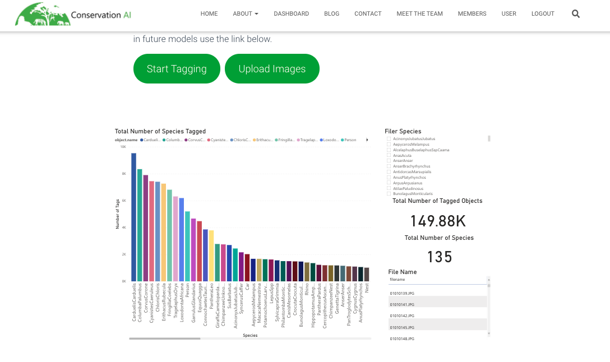
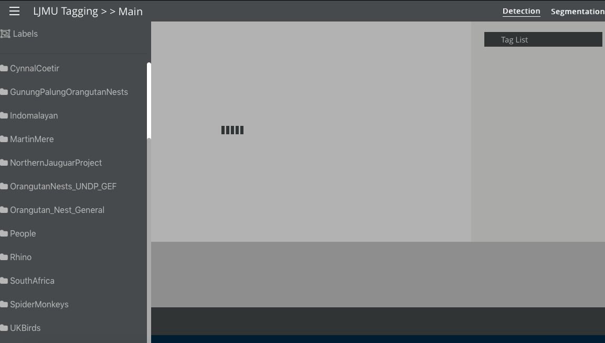
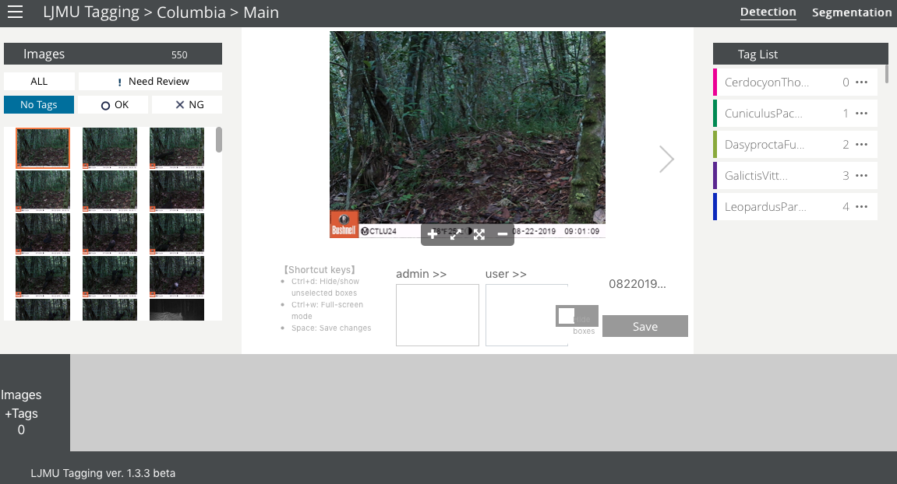
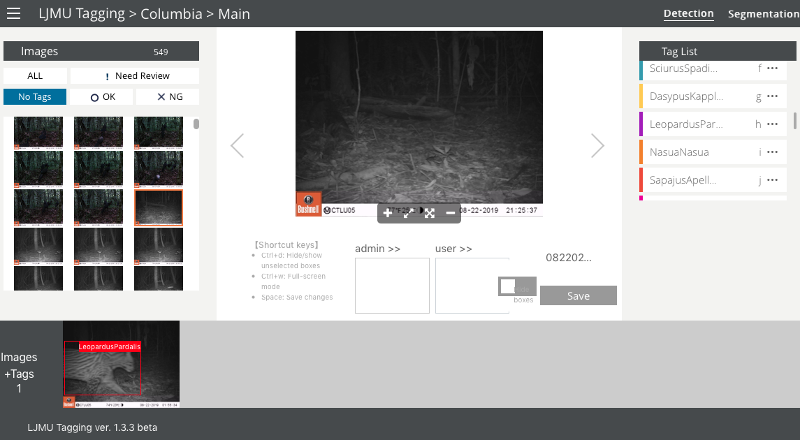
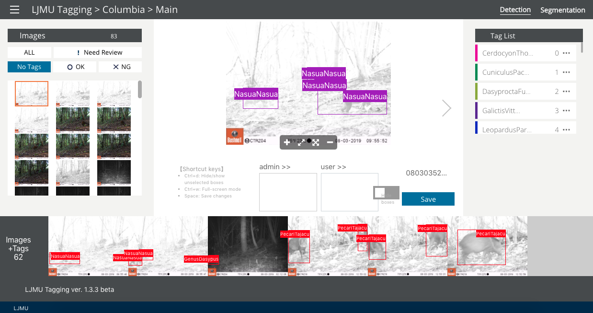
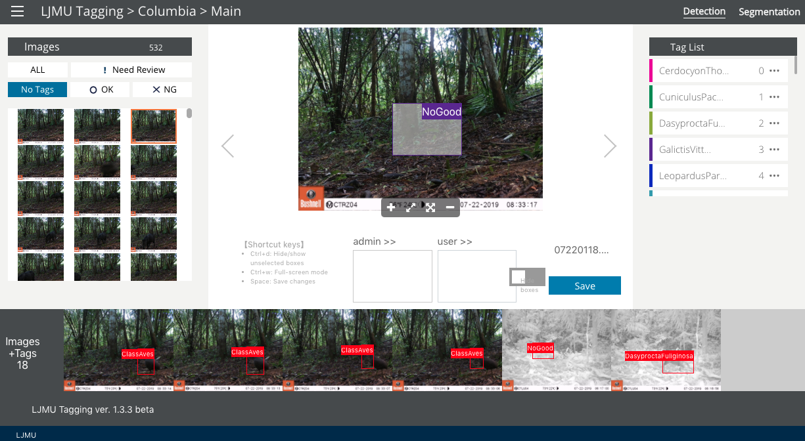

# Conservation AI

Conservation AI is a platform aimed at facilitating the use of AI to solve conservation problems. It is developed by research experts in Machine Learning, Computer Science and Conservation Biology from the Liverpool John Moores University and NVIDIA (a technology company that developed the NVIDIA CUDA®, a collection of libraries and tools for using AI; more information can be found here <https://developer.nvidia.com/gpu-accelerated-libraries>). Currently, Conservation AI can detect species from the United Kingdom, North America and from Sub-Saharan Africa. However, it also provides a user-friendly interface for creating a  data set that can be used to train an AI model to detect species from your particular region. To create the training data set you will need to tag a subset of your images. This step requires creating a bounding box around animals in the images and assigning a species label. We illustrate the tagging process using the Conservation AI infrastructure.

## Set-up

- Create an account here
<https://www.conservationai.co.uk/register/>

- Once you create an account, it needs to be activated by the Conservation AI team. To do that you can contact them using their message center <https://www.conservationai.co.uk/contact/>

- After being approved, you will have a dashboard were you have sections for uploading your files, tagging images with the corresponding classification, and checking AI results (Figure \@ref(fig:dashboard-fig)).

(\#fig:dashboard-fig)Conservation AI dashboard with sections for uploading images, tagging images and checking AI results.

## Upload/format data

The Conservation AI team will help you to set up a project, after which you will be able to upload images and begin the tagging process. You will need to submit a list of species contained in your images to the Conservation AI team, and they will create the tagging project for you. For categories that are not of interest or species that are difficult to identify, you can include in your list higher taxonomic levels (e.g., Class Aves, Order Rodentia). Additionally, you will have to share a subset of images that will be used for training; you can do that either using the "Upload Files" section (Figure \@ref(fig:dashboard-fig)) or using other transfer methods like Google Drive to share your images with the Conservation AI team. The first option is recommended as it allows users to maintain a more independent workflow for image upload; otherwise, you will have to request the Conservation AI team to upload the images for you, which might slow down your tagging process. Uploads are currently limited to 500 images per batch.

## Image tagging

In the tagging section, you can find a report of species that have been tagged within the Conservation AI platform and the number of tags for each species (Figure \@ref(fig:tagging-report)). Here you can check if your species of interest already contains tags from other users. Additionally, after sharing your species list with the Conservation AI team, you will find your species included in this list and see updates of the number of tags for each species as you advance in the tagging process.

(\#fig:tagging-report)Report of species tagged within Conservation AI and number of tags per species.

To begin image tagging, you need to select your project from the project list (Figure \@ref(fig:tagging-projects)).

(\#fig:tagging-projects)List of projects that can be accessed to perform image tagging.

Accessing your project will direct you to your tagging interface (Figure \@ref(fig:tagging-interface)), where you will see images to be tagged at the left, an image viewer at the center, and a tag list at the right (this is the same list that you shared with the Conservation AI team). As you detect and tag species in an image, make sure you select the "Detection" tab in the top right.

(\#fig:tagging-interface)Tagging interface for drawing bounding boxes around animals detected in the images and for assigning species labels.

You will inspect your images using the image viewer, where you can zoom in and out and enter the full-screen mode using the controls below the image. To tag the image, you must draw a bounding box by clicking and dragging a rectangle on top of the animal detected (Figure \@ref(fig:rectangle)). Once you draw the bounding box, you must assign a species label by selecting it from the "Tag list" and save your tag. The image will be moved to the tagged images list at the bottom of the interface (Figure \@ref(fig:saved-tag)). When more than one animal is present, multiple tags can be assigned to the image (Figure \@ref(fig:multiple-objs)). Remember to save all your tags.

(\#fig:rectangle)A bounding box is drawn around an animal detected in the image.

(\#fig:saved-tag)Images tagged will be collected at the bottom of the tagging interface.

(\#fig:multiple-objs)Tags used for multiple animals in an image.

The species might also contain higher taxonomic levels or other categories of interest (e.g., vehicles, people, etc.). It will also contain a "No Good" category that must be used for tagging empty or blurred images (Figure \@ref(fig:no-good)), or images containing small fragments of animal's body parts. The "No Good" images will not be used for model training.

(\#fig:no-good)Use of the "No Good" tag for empty images.

Instead of selecting species labels from the species list at the right, after sketching the bounding box, you can type the shortcuts represented by the letters, numbers or symbols at the right of each species name in the "Tag list". You can edit these shortcuts by clicking the `...` icon.

Once you finish tagging your batch of 500 images, you need to upload another batch to your tagging site. If you shared your images via Google Drive with the Conservation AI team, you can contact them to upload the images for you. The upload of each of these batches by the Conservation AI team can take up a few weeks depending on developers' availability, so it's recommended that you upload your images directly into the platform.

## Process images - AI module

Once the tagging stage is complete, you can contact the Conservation AI team (at admin@conservationai.co.uk) to have them train models using a transfer learning approach using the training data set that you provided in the image-tagging stage. Metadata, such as the time/date of the image and filename, are automatically read once images are uploaded for classification. Thus, you do not need to enter any metadata other than a sensor id if applicable. Completion of model training will depend on the Conservation AI team's availability, so it's important to schedule model training with developers that will re-train models with your data.

You can also classify your images using one of the Conservation AI models currently available, which classify species from the United Kingdom, North America and Sub-Saharan Africa. You can upload images to the "Upload Files" section (Figure \@ref(fig:dashboard-fig)), by browsing files on a local computer. You can select a project name and a model that classifies species from your region of interest. Once the classification stage is complete, the results can be accessed in the platform's analytical dashboard. Model output is shared with the data owner after a request is sent to the Conservation AI team. The output is provided in CSV, Excel or PDF format and will include rows for every image, folder names (image path), species name, confidence values (above a 0.5 confidence threshold), sensor name and project name.

## Conclusions

We have seen how to set up a project, upload and use AI to classify camera trap photos using Conservation AI's platform. We described how to use the Conservation AI's infrastructure for image tagging and model training for specific data sets. Conservation AI does not have models for classification of species from South America; for assessing model performance for species from geographical regions included in Conservation AI models, please refer to the methods described in Chapters [3][Wildlife Insights] and [5][MLWIC2: Machine Learning for Wildlife Image Classification].
