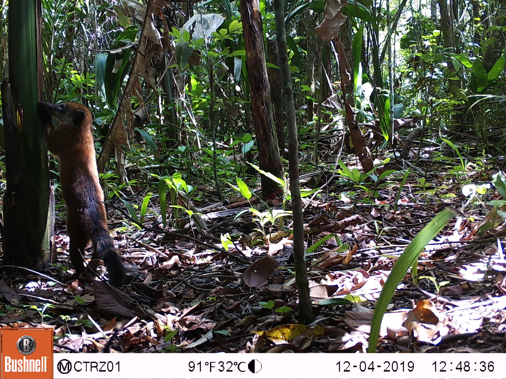
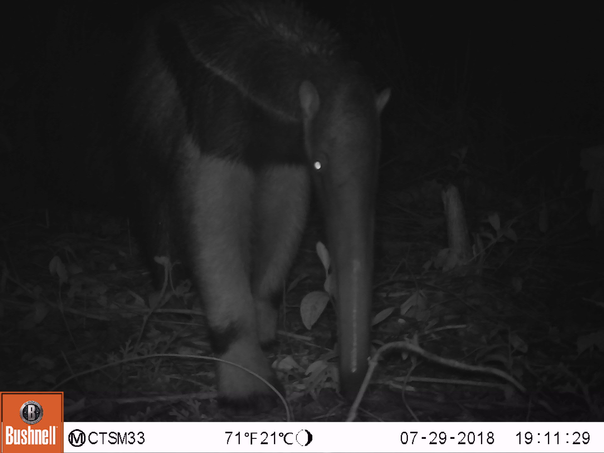
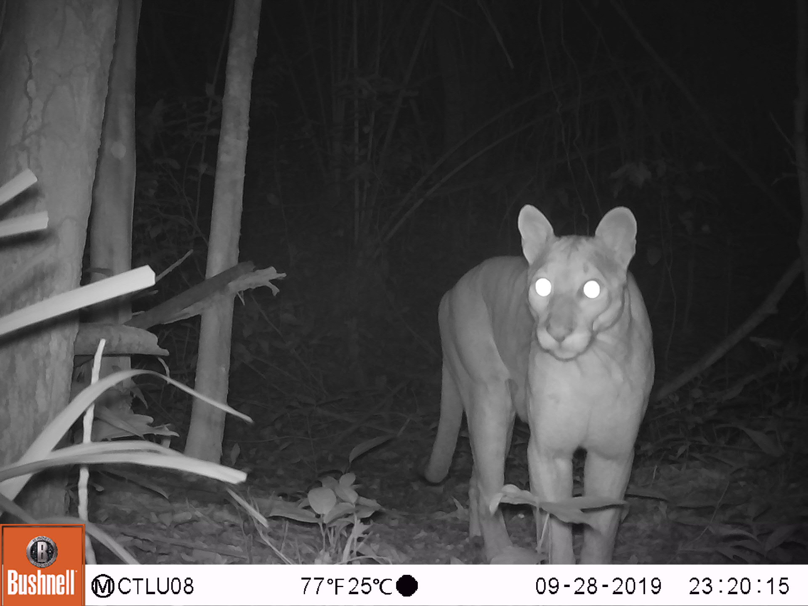
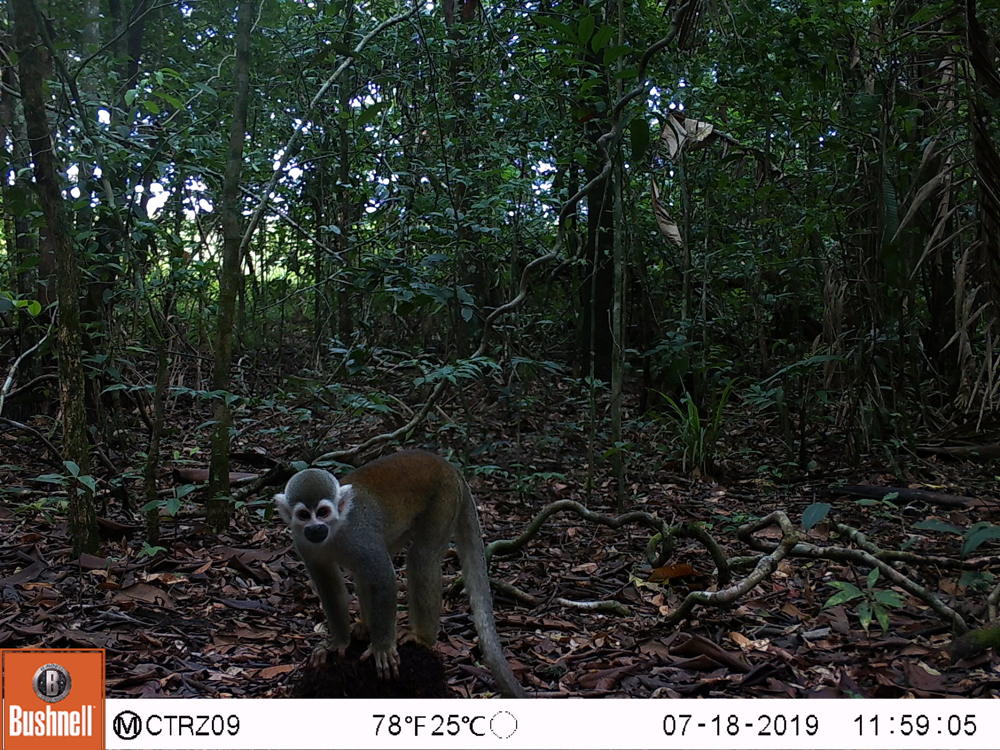

--- 
title: "Guide for using artificial intelligence platforms for camera-trap data processing"
author: "Juliana Velez and John Fieberg"
date: "2022-08-10"
site: bookdown::bookdown_site
output: bookdown::gitbook
documentclass: book
bibliography: [book.bib, packages.bib]
biblio-style: apalike
link-citations: yes
#github-repo: rstudio/bookdown-demo
description: "We aim to provide an overview of the steps required to use platforms that implement artificial intelligence into workflows for processing camera-trap images."
---
 
#  {-} 



```{=html}
<br>
<b>Cover photograph</b>: 
<br>
Camera-trap images collected in the reserves El Rey Zamuro and Las Unamas, located in the Meta department in the Colombian Orinoquia.
<br>
<br>
```


```{=html}
<b>Suggested Citation:</b>
<br>
Velez, J. and J. Fieberg. 2022. Guide for using artificial intelligence platforms for camera-trap data processing. https://ai-camtraps.netlify.app/.
<br>
<br>
```
